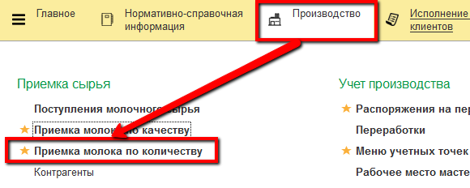
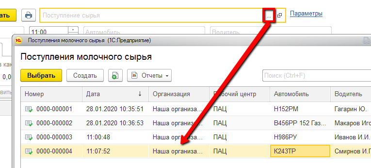
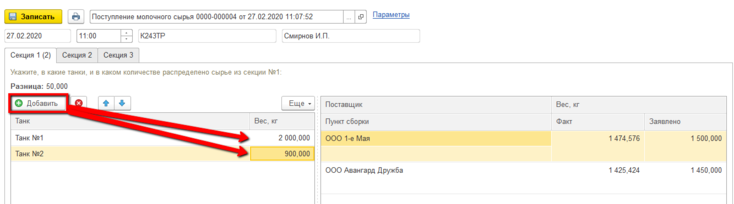

# Учет фактического количества принимаемого молока

Учет фактического количества принимаемого молока происходит через
обработку "Приемка молока по количеству".

-   Открыть обработку "Приемка молока по количеству":  
  
-   Выбрать документ, соответствующий машине (ориентировать можно по
    времени, номеру и водителю), с которой будет сливаться молоко:  
    
Автоматически заполнятся заявленные веса по секциям.  
-   По каждой секции указать, сколько в какой танк было закачано молока:  
  
-   Нажать "Записать"