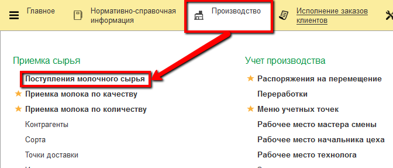
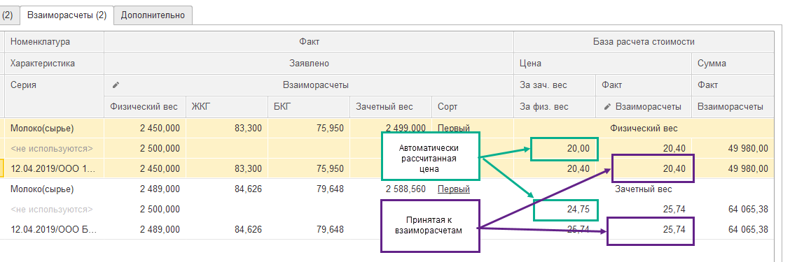
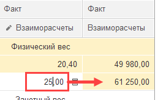

# Расчет стоимости поступившего молока

Расчет стоимости поступающего молока происходит автоматически в
документах "Поступление молочного сырья", на основании заранее
подготовленной информации в системе.

 

Открыв любой готовый документ, можно посмотреть полученную цену: на
вкладке "Взаиморасчеты" столбец "Цена" в представленной таблице:

 

При этом цена, получившаяся на основании различной информации, учтенной
в системе, и цена, по которой будут произведены взаиморасчеты, могут
отличаться. Автоматически эти цены ставятся одинаковыми. Но в любом
документе цену взаиморасчетов можно изменить вручную, тогда итоговая
сумма также будет пересчитана:

