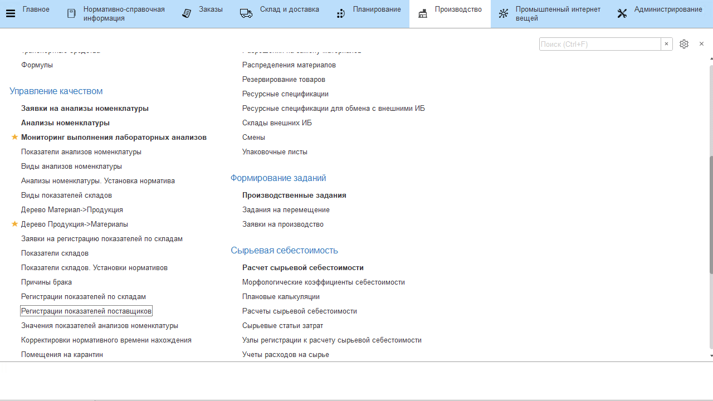

# Установка показателей поставщиков на декаду

Установка значений некоторых показателей поставщиков (например,
микробиологических), которые не проводятся при каждой приемке, но при
этом согласовываются с поставщиком как фактические на определенный
период записываются документом **"Регистрации показателей поставщиков"**.

-   Открыть список документов **"Регистрации показателей поставщиков"** и перейти к
    созданию нового;
-   Указать номенклатуру принимаемого сырья; 
-   Указать вид анализа, включающий устанавливаемые показатели;
-   Указать поставщика и, если необходимо, пункт сборки, для которого
    эти показатели задаются;
-   Указать начало и окончание действия показателей;
-   Перейти на вкладку *"Показатели"*, заполнить все согласованные
    значения;
-   Нажать **"Провести и закрыть"**.

