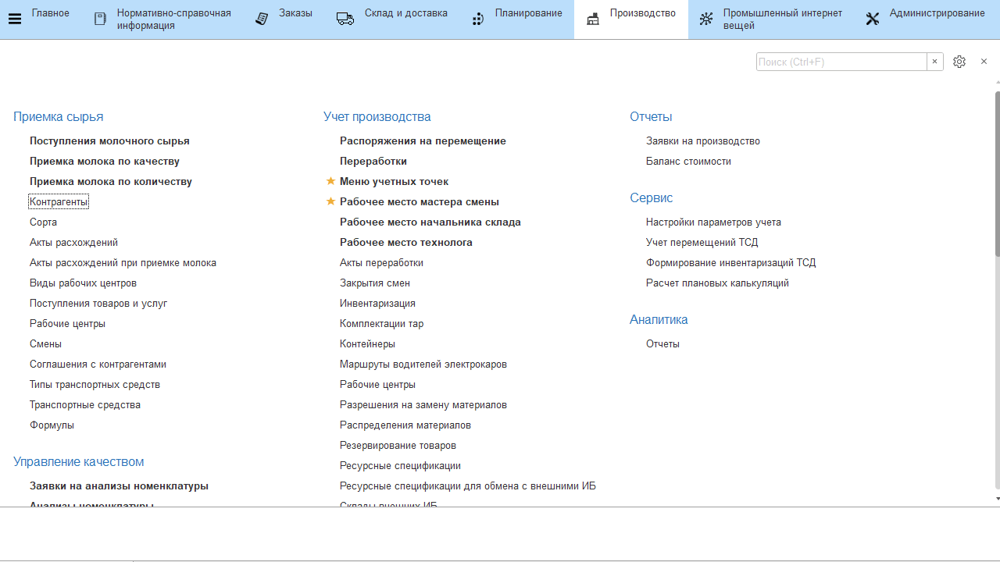
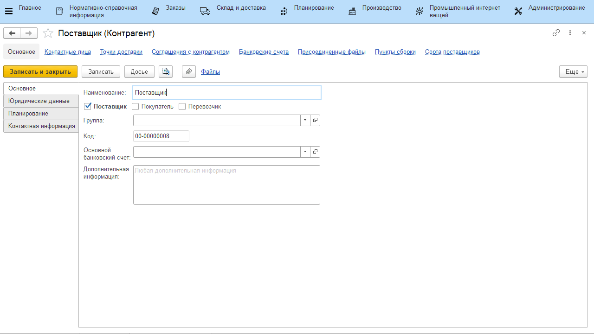
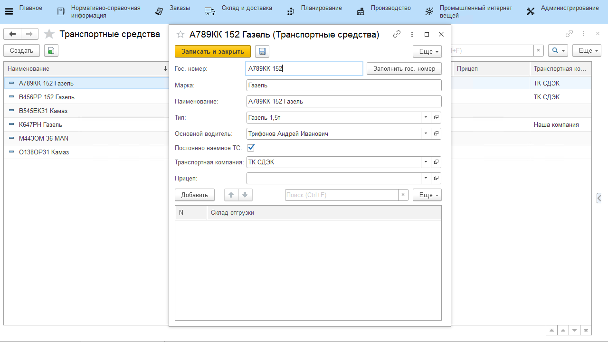

# Поставщики молочного сырья

## Справочник "Контрагенты"
Информация о всех поставщиках молочного сырья записывается в справочник **"Контрагенты"**.

- Открыть справочник и перейти к созданию нового элемента;
- Указать наименование организации и отметить галочкой, что это "Поставщик". Для справочной информации заполнить остальные поля;
- На вкладке *"Планирование"* указать тип поставщика.
- Нажать **"Записать"**.

## Справочник "Пункты сборки"

У поставщиков также может быть несколько пунктов сборки молока. Все они указываются в справочнике **"Пункты сборки"**, в который можно перейти прямо из карточки поставщика:

  

## Справочник "Транспортные средства"

Информация о всех машинах, принадлежащих автоматизируемой организации, на которых привозится молоко от разных поставщиков записывается в справочник **"Транспортные средства"**.

- Открыть справочник и перейти к созданию нового элемента;
- Указать:
    - Гос.номер машины;  
    - Марка машины;  
- В поле *"Основной водитель"* перейти к созданию нового элемента
    справочника **"Физические лица"** (или, если уже есть, выбрать из
    списка). Указать ФИО водителя и записать его. После чего физ.лицо будет
    выбрано автоматически в качестве основного водителя создаваемого ТС; 
- Нажать **"Записать и закрыть"**.

