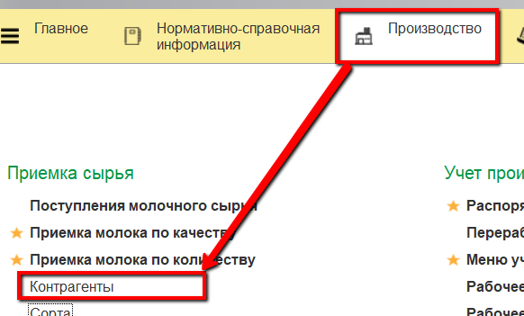
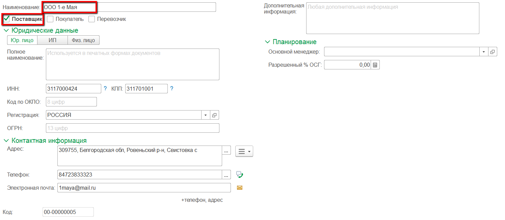
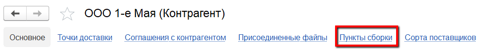
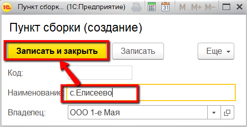
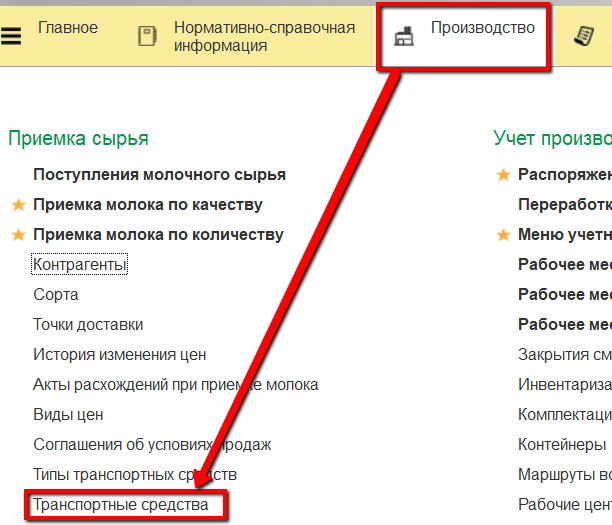
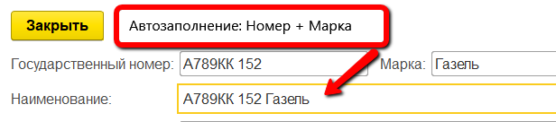
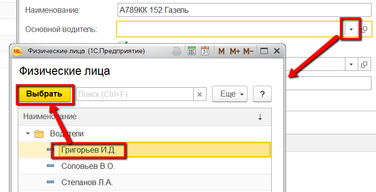
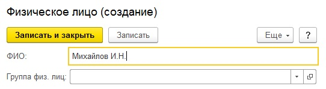

**Поставщики молочного сырья**
==============================

**Справочник "Контрагенты".**  
Информация о всех поставщиках молочного
сырья записывается в справочник "Контрагенты".

 

1.   Открыть справочник и перейти к созданию нового элемента:  
  
2.   Указать наименование и отметить галочкой, что это "Поставщик". Для
    справочной информации заполнить остальные поля:  
  
3.   Нажать "Записать".

**Справочник "Пункты сборки"**

У поставщиков также может быть несколько пунктов сборки молока. Все они указываются в справочнике "Пункты сборки", в который можно перейти прямо из карточки поставщика:  
  

1.   Перейти к созданию нового, указать наименование и записать:  
  

**Справочник "Транспортные средства".**  

Информация о всех машинах, принадлежащих автоматизируемой организации, на которых привозится молоко от разных поставщиков записывается в справочник "Транспортные средства".

1.   Открыть справочник и перейти к созданию нового элемента:  
  
2.   Заполнить следующую информацию:  
2.1.   Гос.номер машины;  
2.2.   Марка машины;  
      
2.3.   В поле "Основной водитель" перейти к созданию нового элемента
    справочника "Физические лица" (или, если уже есть, выбрать из
    списка). Указать ФИО водителя и записать его. После чего он будет
    выбран автоматически в качестве основного водителя создаваемого ТС:  
      
    Создание:  
    
>    Примечание. Для дальнейшей связи поступаемых машин с молоком с
    элементами данного справочника заполненной информации достаточно. Но
    при необходимости можно заполнить остальные поля.  
3.   Нажать "Записать и закрыть".

