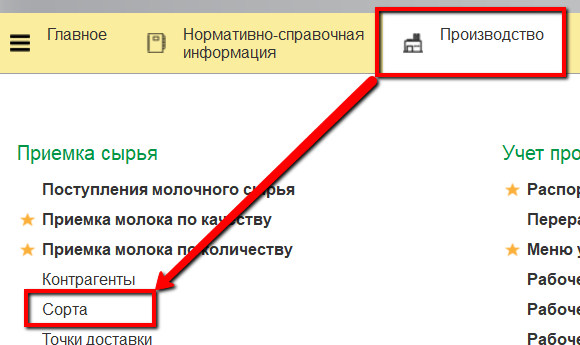
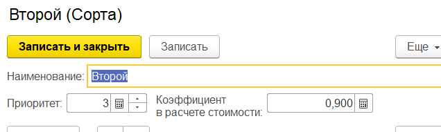
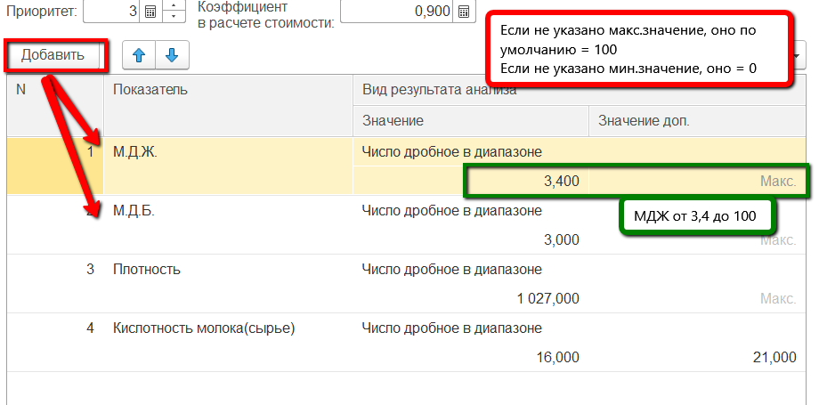

**Сорта молока**
================

Все сорта молока отражаются в справочнике "Сорта".

 

 

-   Открыть справочник и перейти к созданию нового элемента:

-   Указать
    -   Название;
    -   Приоритет - чем меньше, тем "дороже" сорт. Например, сорт с
    приоритетом "1" оценивается дороже, чем сорт с приоритетом "2";
    -   Коэффициент в расчете стоимости - тот коэффициент, на который будет
    умножаться стоимость молока в зависимости от его сорта:

    

-   В таблице перечислить все показатели анализов молока, которые влияют
    на определение его сорта, и напротив каждого из них указать значение
    (диапазон),  соответствующее этому сорту:

    

-   Нажать "Записать и закрыть".

