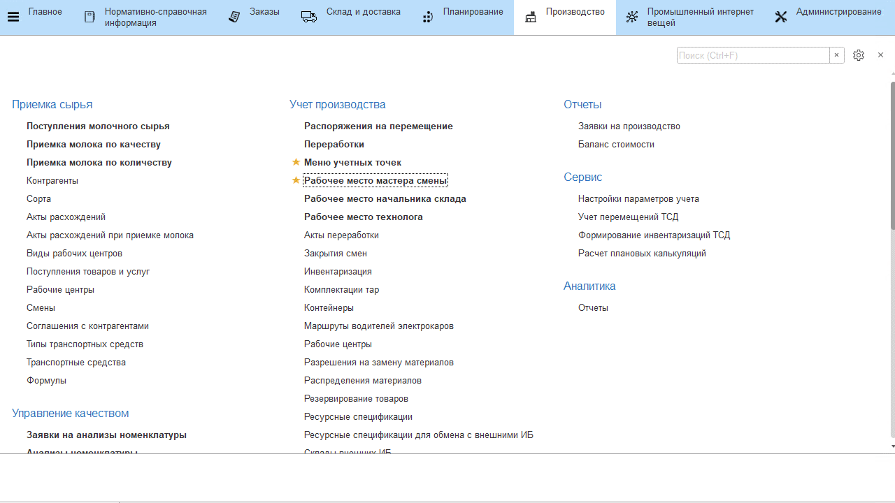

# Выпуск производственной партии молока

Выпуск производственной партии нужно фиксировать каждый раз, когда в
танке сырого молока берется контрольный анализ (жир, белок и прочие
показатели). Выполняется мастером цеха через его рабочее место.

-   Открыть **"Рабочее место мастера смены"**;
-   Указать дату смены и смену;   
-   Указать участок приемно-аппаратного цеха;
-   Выбрать рабочий центр, на котором принимается молоко; 
-   Перейти на вкладку *"Остатки"*;
-   Переключиться в режим диаграммы.

На диаграмме видно, что в танке находится много партий от разных поставщиков, которые в действительности перемешались, и по ним лаборатория взяла контрольный анализ. 
    
-   Выделить, зажав клавишу Ctrl, все партии и нажать **"Объединить партии"**;
-   Потдвердить действие.

Теперь можно видеть одну производственную партию в этом танке: 
 
  

