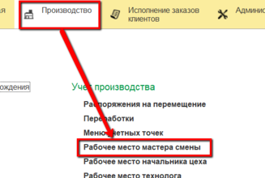
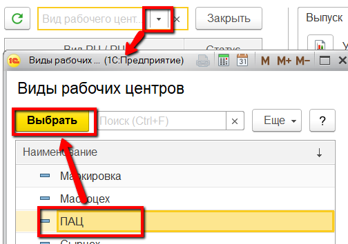
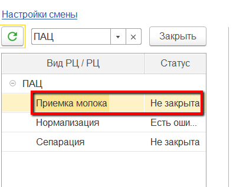
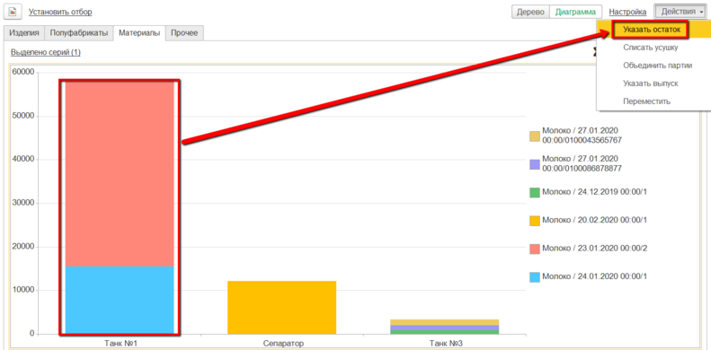
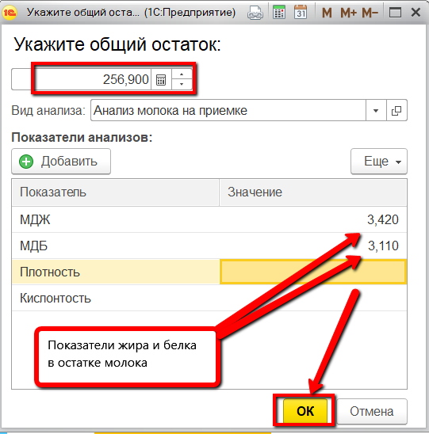
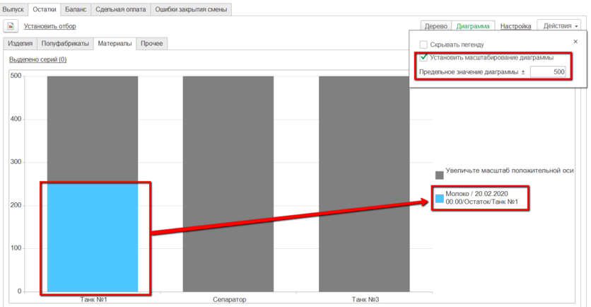

# Указание остатков молока на конец дня

Мастер через свое рабочее место в конце смены должен указать, в каком танке сколько молока осталось.

-   Открыть "Рабочее место мастера смены":  
  
-   Указать дату смены и смену:  
  
-   Указать участок приемно-аппаратного цеха:  
  
-   В таблице ниже выбрать участок, на котором хранится принятое сырье:  
  
- На вкладке "Остатки" -\> "Материалы" отображается информация по
    оборотам молока в каждом танке.    
Необходимо указать остатки молока по каждому танку при наличии
    таковых на конец смены. Для этого нажать на нужный танк (неважно, в
    каком режиме) и нажать "Указать остаток":  
   
-   Указать, сколько кг осталось и какие показатели жира и белка у
    остатка, и подтвердить:  
     
В диаграмме появится новый блок, соответствующий остатку (можно увеличить масштаб диаграммы):   
  
Повторить для каждого танка.

