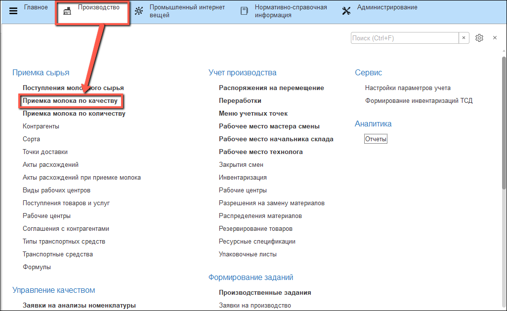
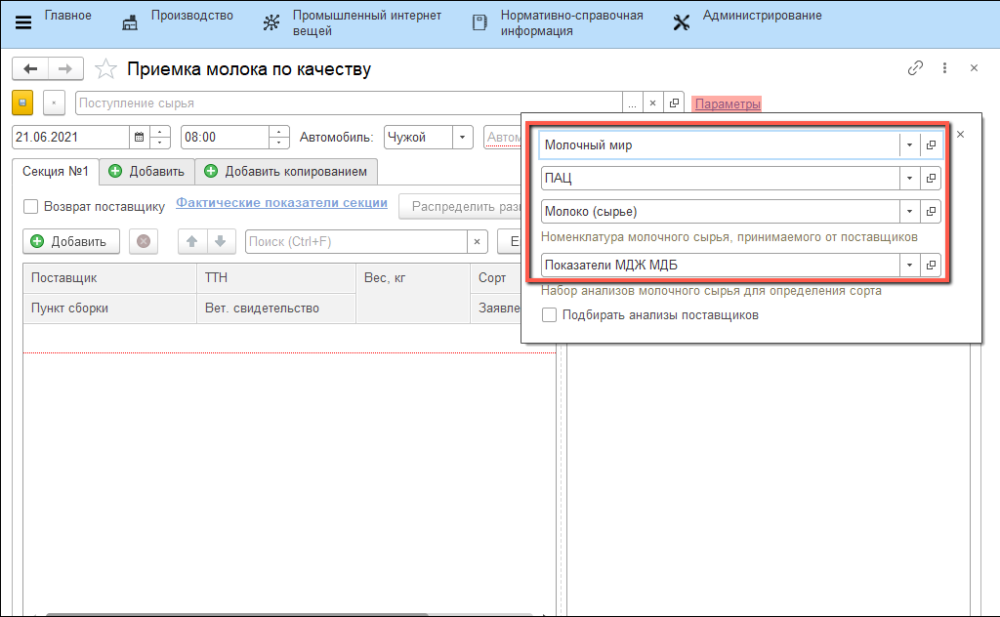
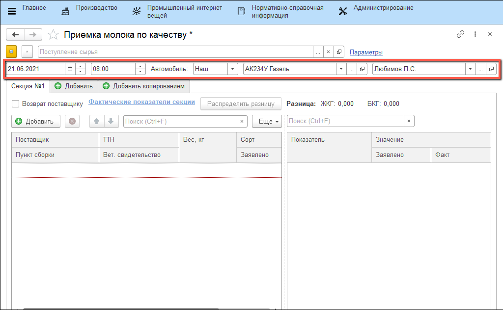
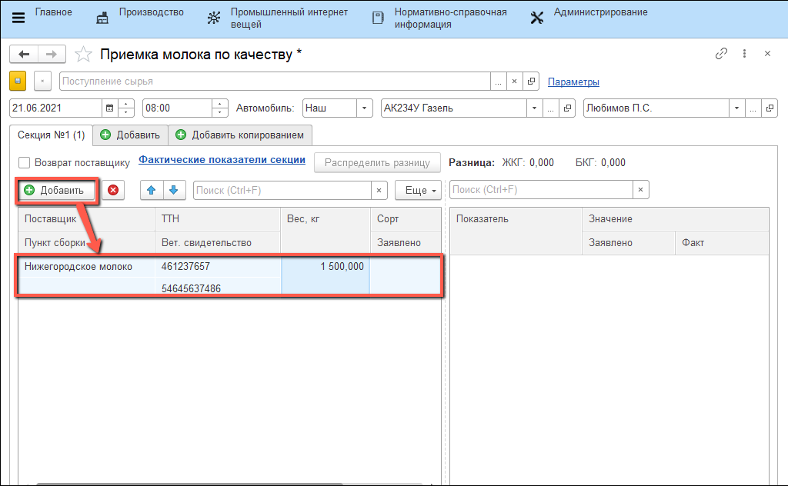
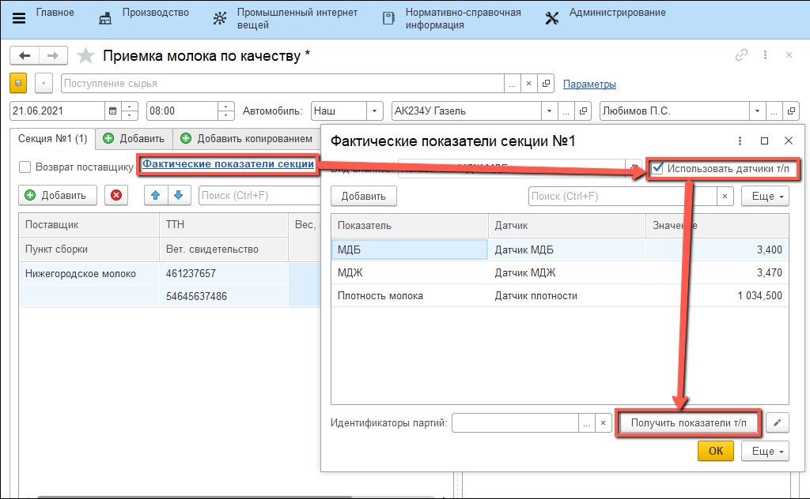
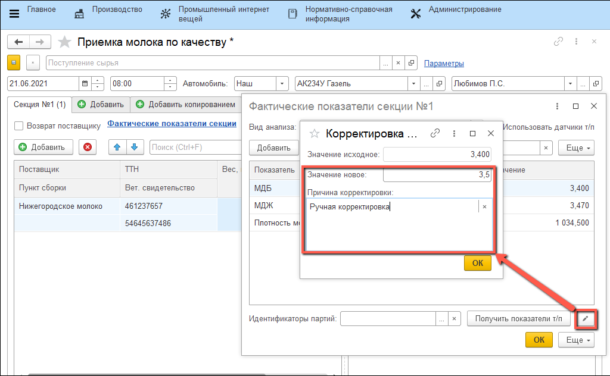
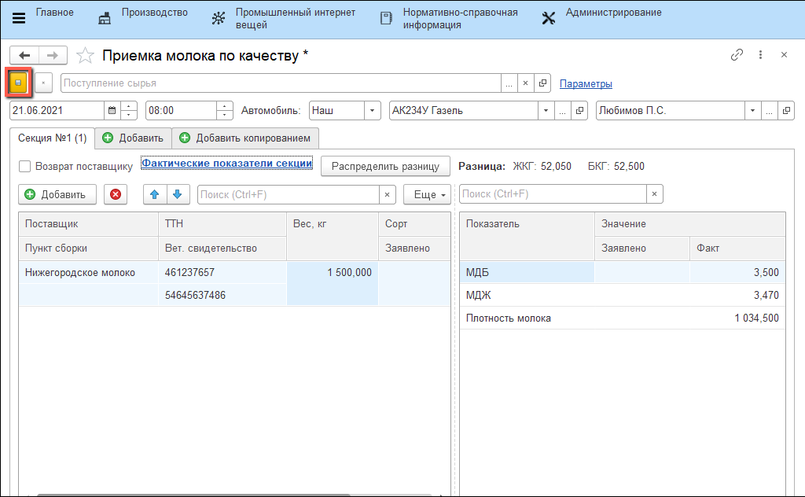

# Приемка молока по качеству с использованием значений датчиков

Если в системе [настроены датчики](SystemSetting/Sensors.md), которые получают данные по качественным показателям молочного сырья, то процесс приемки молока можно упростить путем обращения к этим датчикам.

- Открыть обработку "**Приемка молока по качеству**":

  

- Указать параметры: "**Организация**", "**Рабочий центр**", "**Молоко или обрат**", "**Вид анализа**":

  

- Указать данные о "**Дате**" и "**Времени**", а также сведения об "**Автомобиле**" и "**Водителе**":

  

- На вкладке "**Секция №**" добавить строку и заполнить её:

  

- Нажать на ссылку "**Фактические показатели секции**", в открывшейся форме установить флаг "**Использовать датчики т/п**" и нажать на кнопку "**Получить показатели т/п**":

  

- Значения, полученные с датчиков можно откорректировать. Для этого нужно нажать на соответствующую иконку рядом с кнопкой "**Получить показатели т/п**", указать "**Значение новое**" и "**Причину корректировки**":

  

- После этого документ "**Поступление молочного сырья**" необходимо записать:

  