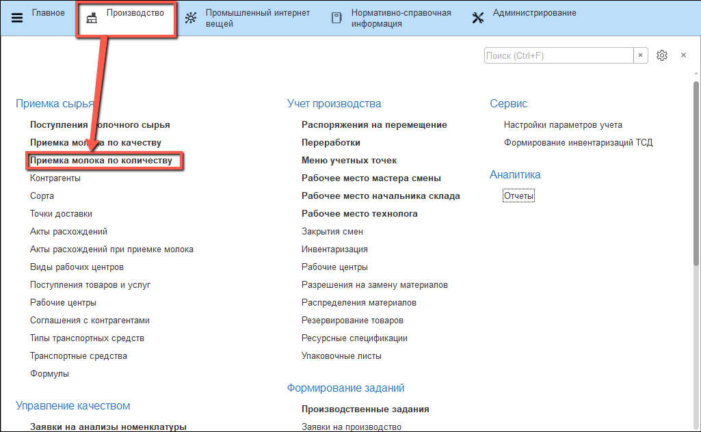
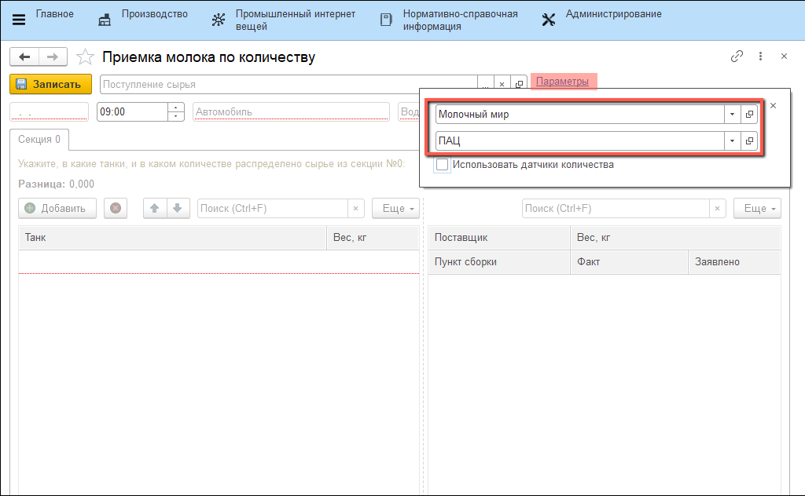
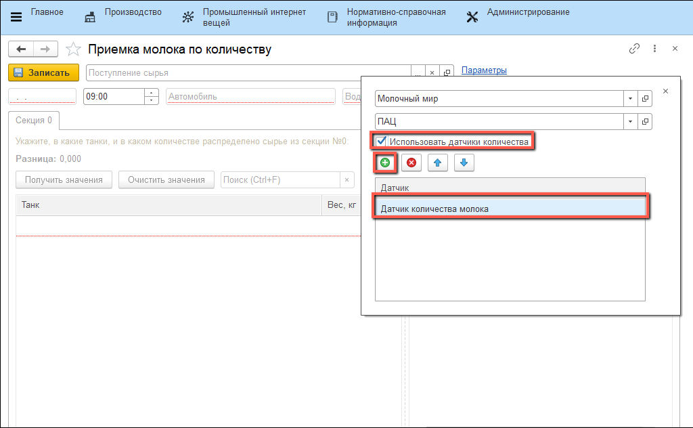
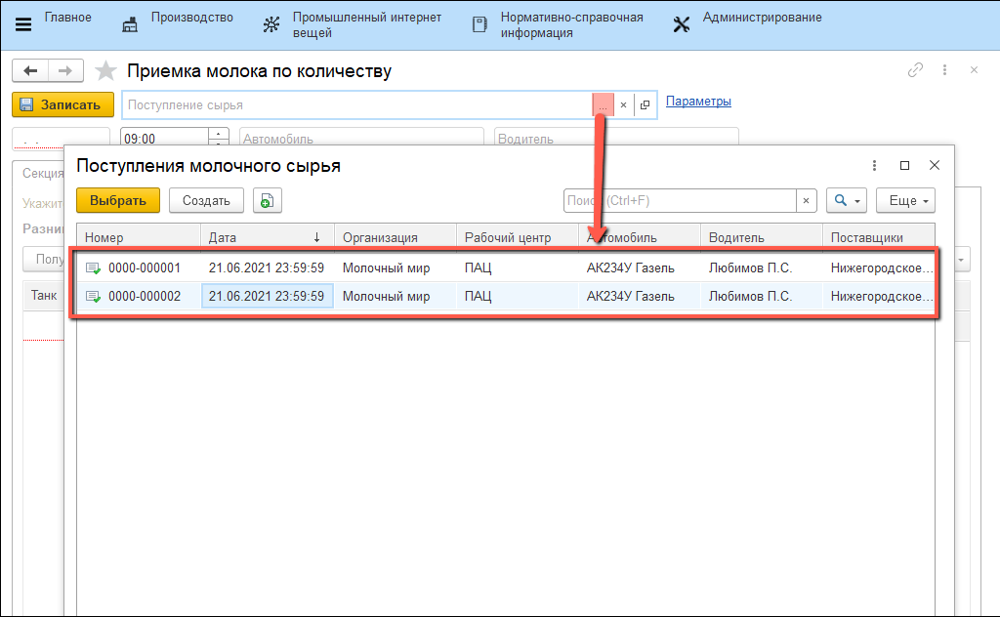
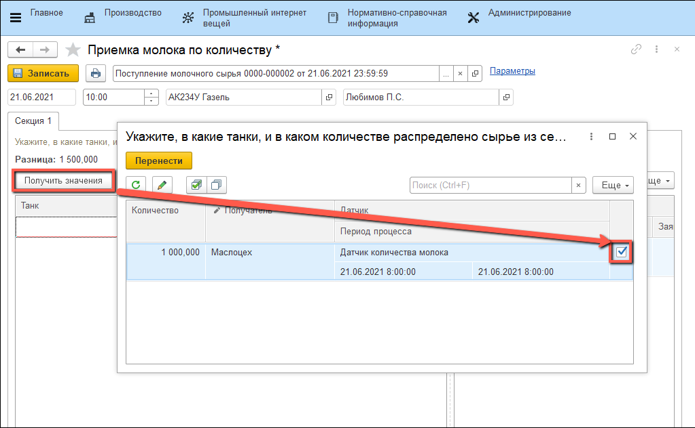
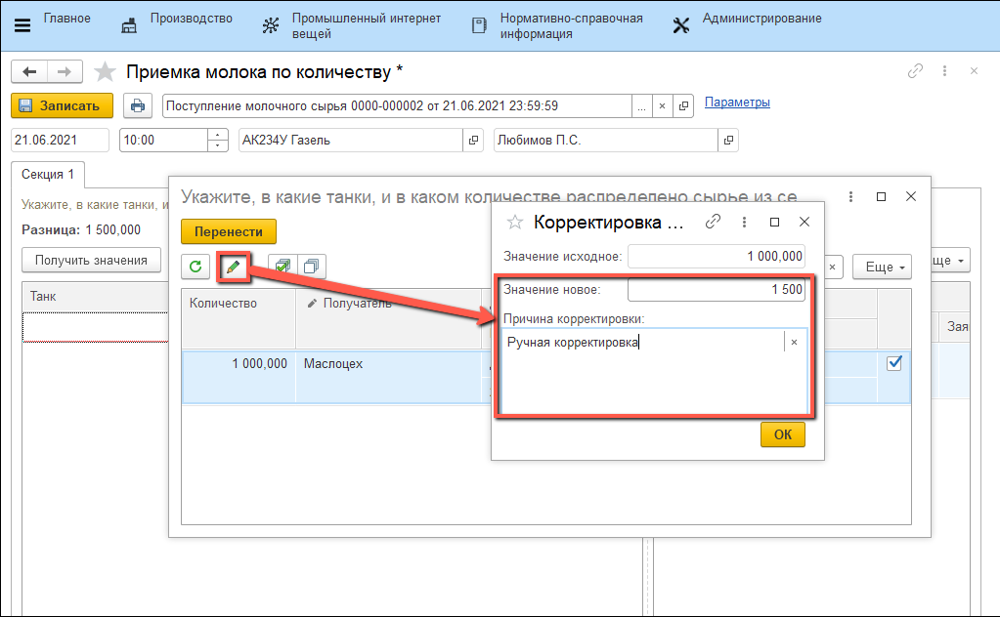
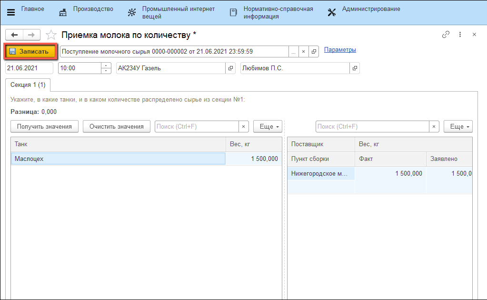

# Приемка молока по количеству с использованием значений датчиков

Если в системе [настроены датчики](SystemSetting/Sensors.md), которые учитывают количество молочного сырья ("Тип данных" Датчика  - Производство), то процесс приемки молока можно упростить путем обращения к этим датчикам.

- Открыть обработку "**Приемка молока по количеству**":

  

- Указать параметры: "**Организация**", "**Рабочий центр**" и установить флаг "**Использовать датчики количества**" :

  

- Добавить датчик в список:

  

- Выбрать документ "**Поступление молочного сырья**":

  

- Нажать на кнопку "**Получить значения**", В открывшейся форме установить флажки в строках для которых нужно получить значения:

  

- Значения, полученные с датчиков можно откорректировать. Для этого нужно нажать на соответствующую иконку, указать "**Значение новое**" и "**Причину корректировки**":

  

- После этого документ "**Поступление молочного сырья**" необходимо записать:

  