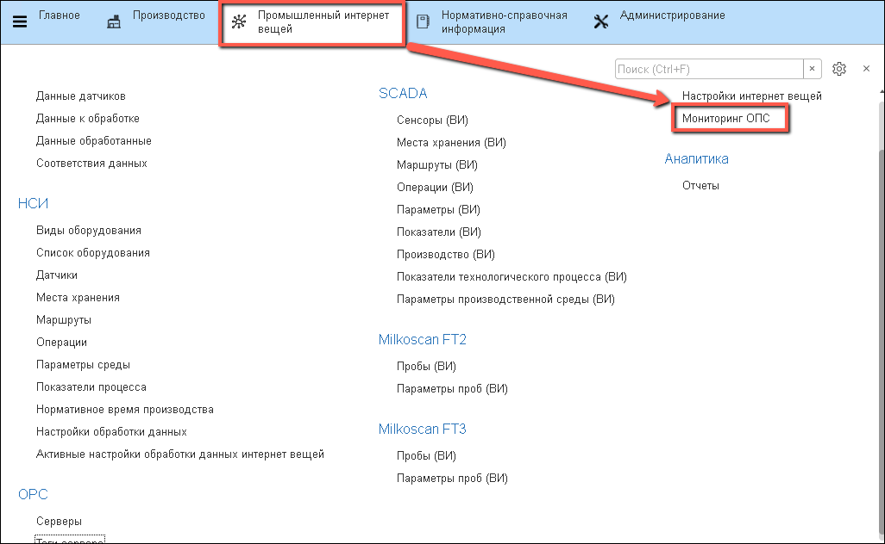
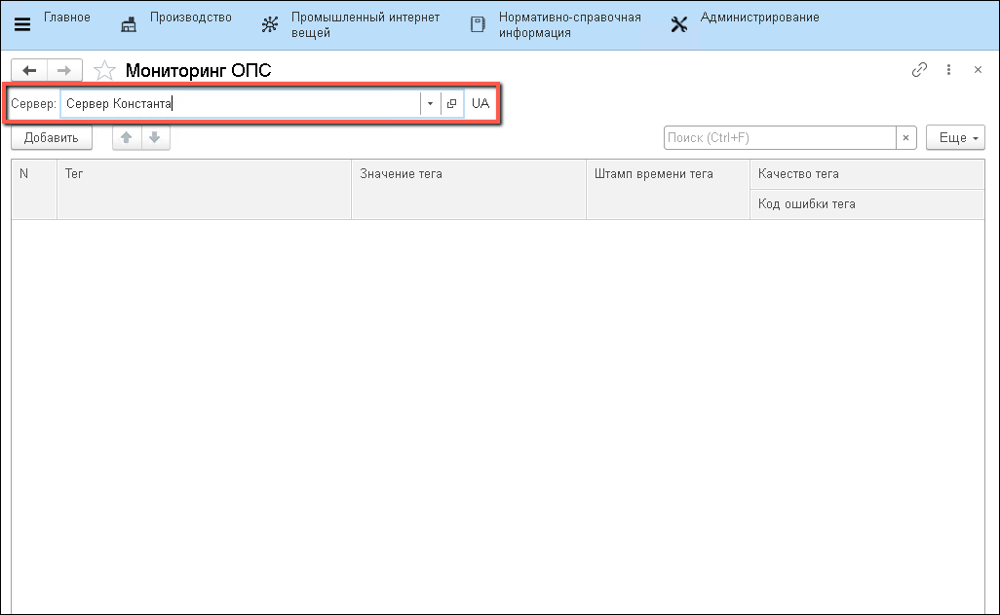
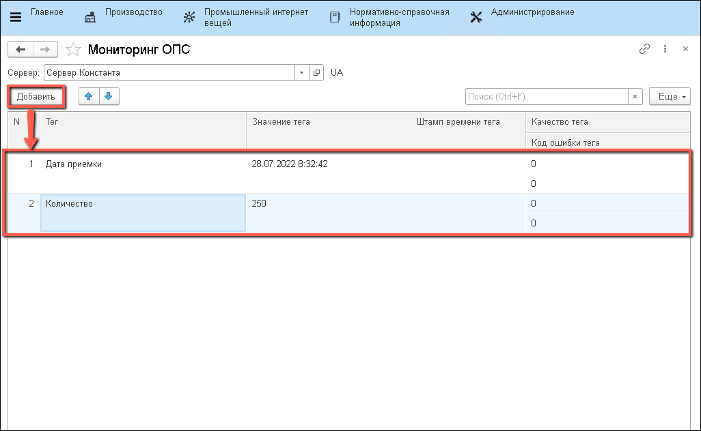
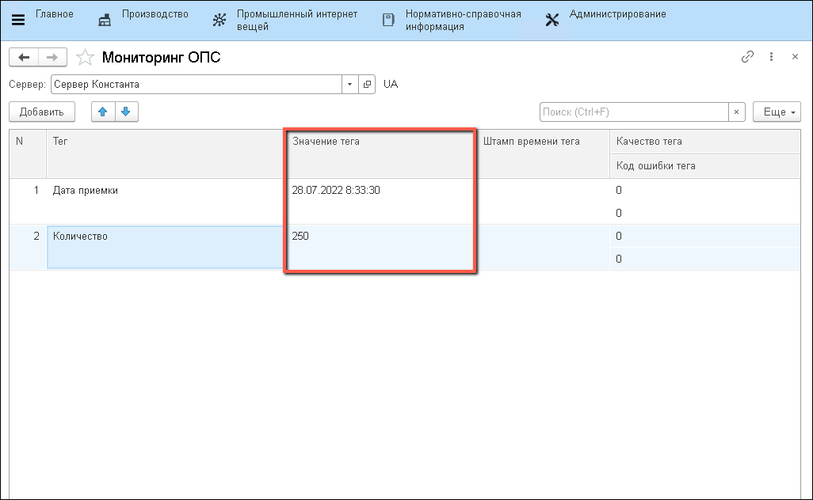

# Мониторинг данных датчиков

Справочно посмотреть, какое значение имеет конкретный тег в настоящий момент времени, можно в соответствующем инструменте.

- Открыть "Мониторинг ОПС":

- Указать "**Сервер**", у которого будут отслеживаться значения "**Тегов**":

  

- В таблицу добавить "**Теги**", значения которых нужно проследить:

  

- Теперь можно в режиме реального времени следить за значениями перечисленных тегов:

  

!!! danger "Постоянное обновление таких данных приводит к большой нагрузке на систему. Не стоит использовать инструмент в течение долгого времени"