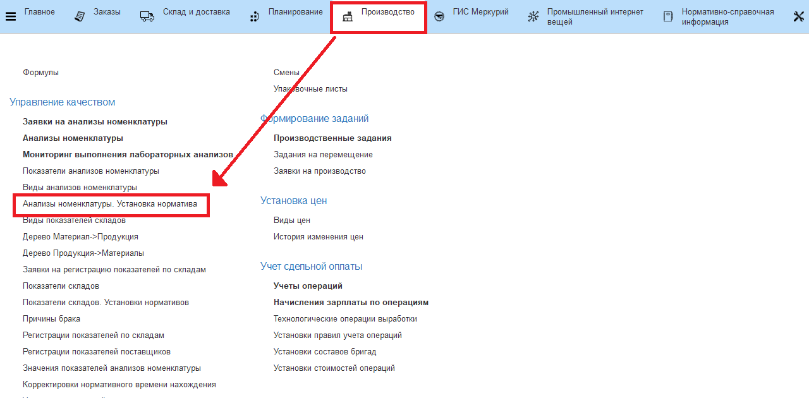
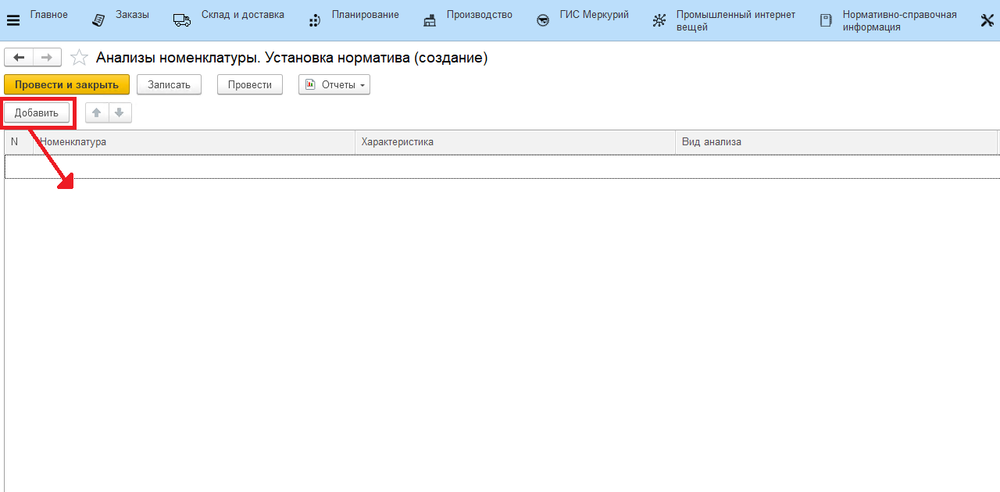
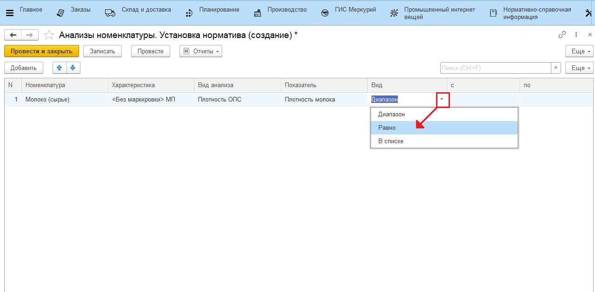
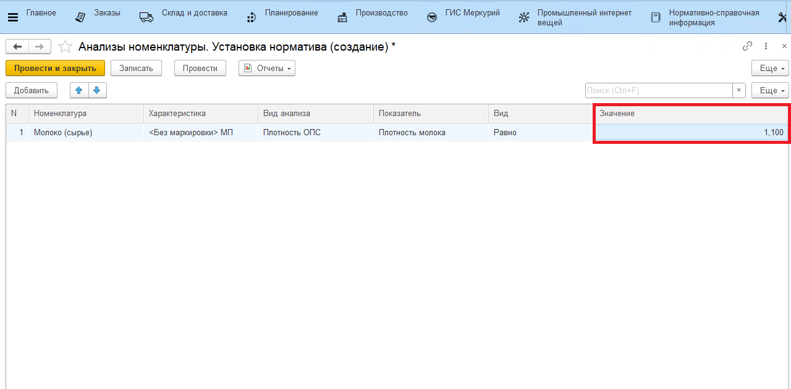

# Установка нормативной плотности для обработки данных датчиков

Если значения с датчиков приходят, например, в литрах, а для использования в системе их нужно пересчитывать в килограммы, и при этом известна нормативная плотность, по которой это можно сделать, то для каждой продукции нужно задать это значение в справочнике.

- Открыть документы "Анализы номенклатуры. Установка норматива":

  

- Перейти к созданию нового норматива. Для каждой продукции указать, какой показатель отвечает за плотность для пересчета (в т.ч. в каком виде анализа этот показатель искать):

  

- Указать вид сравнения - "Равно". С другим видом будет выведена ошибка:

  

- Указать нормативное значение плотности. Пересчет будет идти по нему:

  

- Нажать "Провести и закрыть".