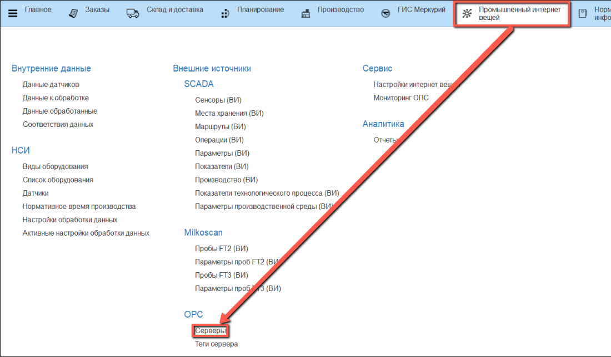
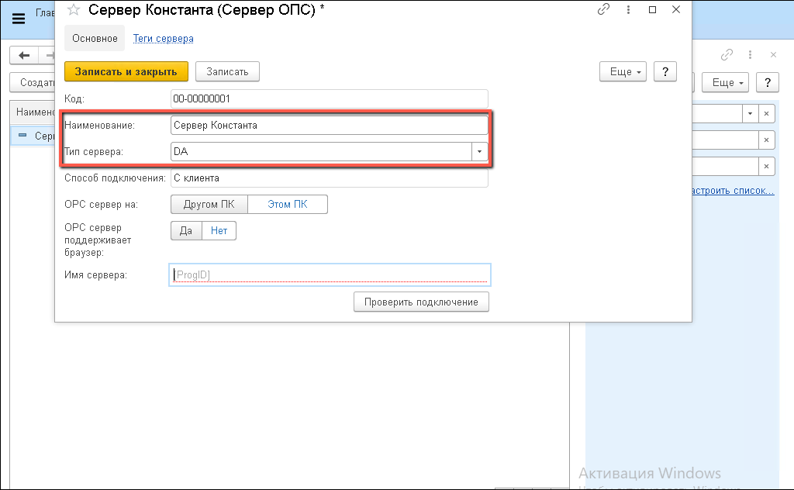
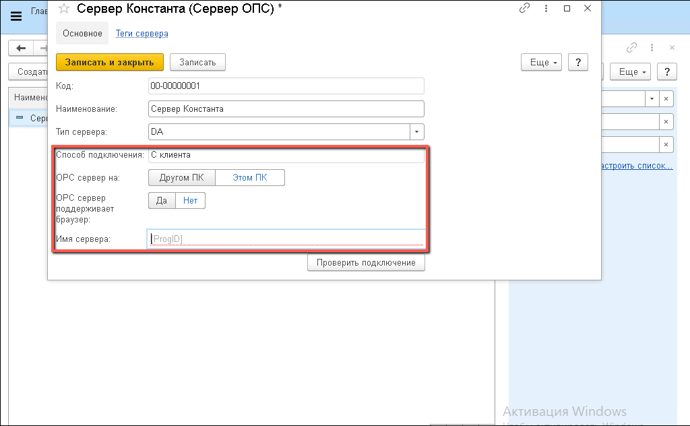
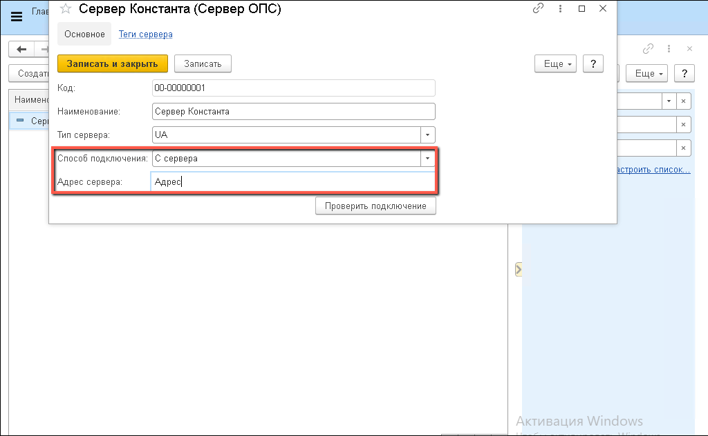
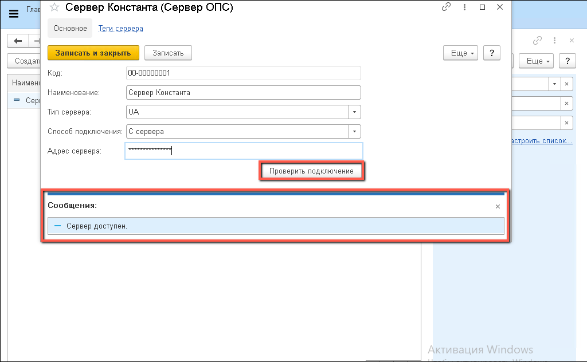
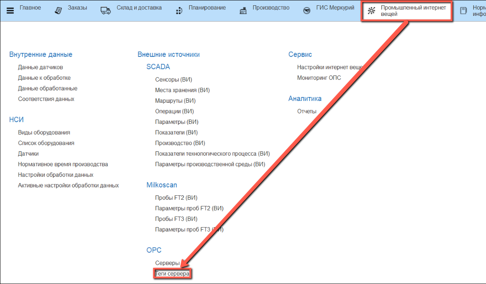
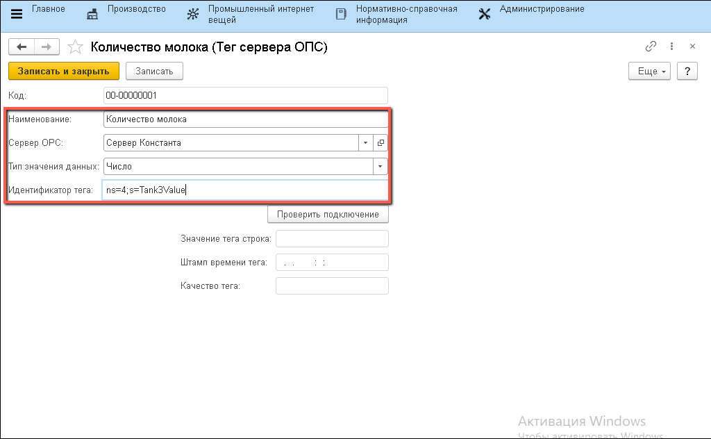
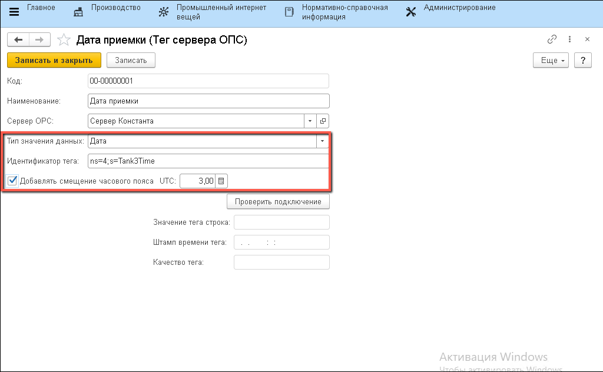
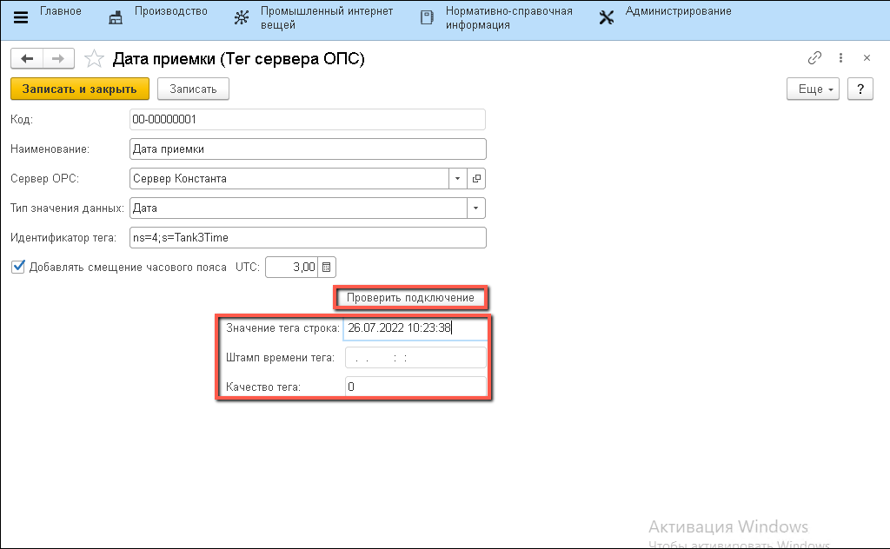

# Серверы и теги

Для начала получения информации с датчиков необходимо настроить в системе данные о сервере и тегах, с которыми будет идти работа.

## Серверы

В системе можно указать сразу несколько серверов для обмена информацией. Чтобы настроить сервер, необходимо:

- Открыть справочник "**Серверы**"

- Перейти к созданию нового элемента
- Указать "**Наименование сервера**", "**Тип сервера**"
    - _DA (Data Access) — основной (общепризнанный) и наиболее востребованный стандарт. Предоставляет доступ к данным изменяющимся в реальном времени._
    - _UA (Unified Architecture) — последний по времени выпуска стандарт. Имеет кросс-платформенную совместимость._

- В случае выбора типа "**DA**" заполнить открывшиеся поля: "**OPC сервер на**", "**OPC поддерживает браузер**" и "**Имя сервера**".

- В случае выбора типа "**UA**" указать "**Способ подключения**" и "**Адрес сервера**":

После выполнения настройки можно проверить подключение к серверу, нажав кнопку "**Проверить подключение**". При отсутствии ошибок будет получено сообщение о доступности сервера.

## Теги сервера

К одному датчику можно привязать сразу несколько тегов. Например, тег, который содержит прочитанное с датчика значение, тег, который содержит время получения этого значения и т.п.. Все эти теги нужно указать в системе.

- Открыть справочник "Теги сервера":

- Перейти к созданию нового элемента. Указать наименование тега, "**Сервер OPC**", "**Тип значения данных**", "**Идентификатор тега**". Удобнее задавать наименование тега по шаблону: "<К какому датчику относится тег> <Какую именно информацию об этом датчике он содержит>".

- Если "**Тип значения данных**" - "**Дата**", то указать смещение часовых поясов (если есть) между временем на сервере (UTC) и местным временем. 

- Записать. После этого можно проверить доступность тега и посмотреть его текущее значение, нажав кнопку "**Проверить подключение**". При успешном подключении значения полей ниже заполнятся.

