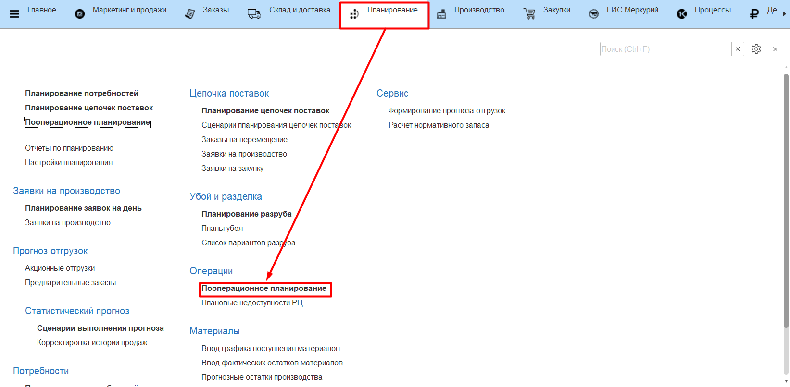
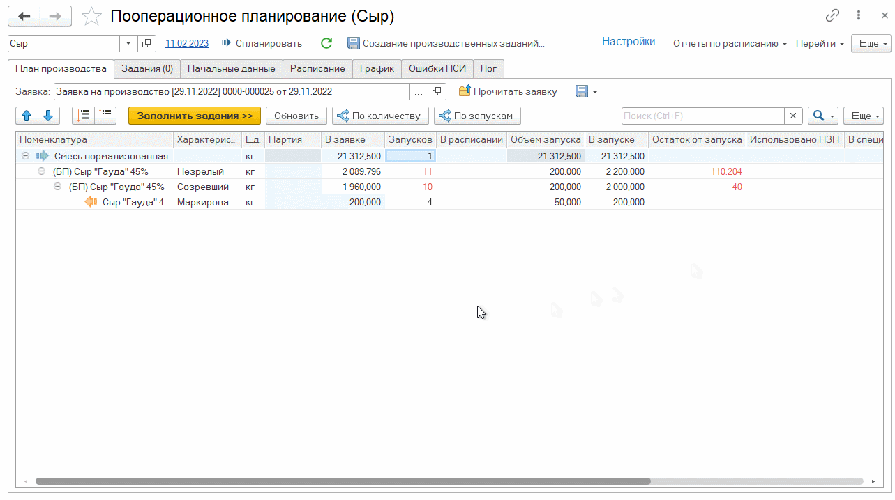
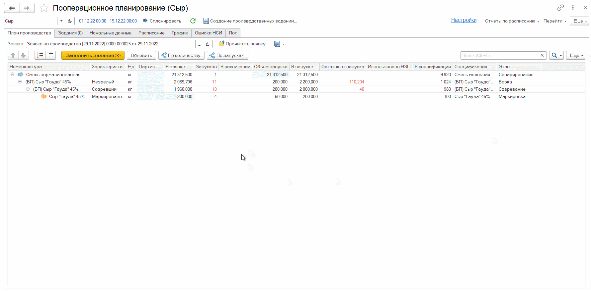
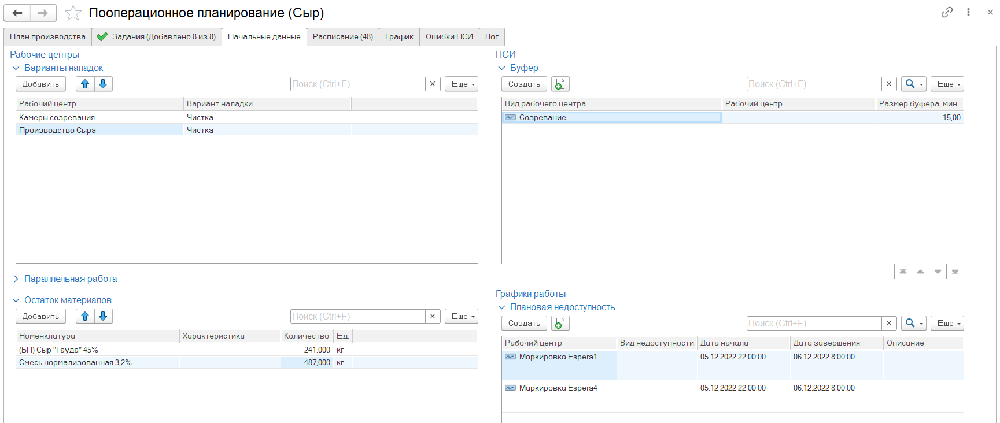
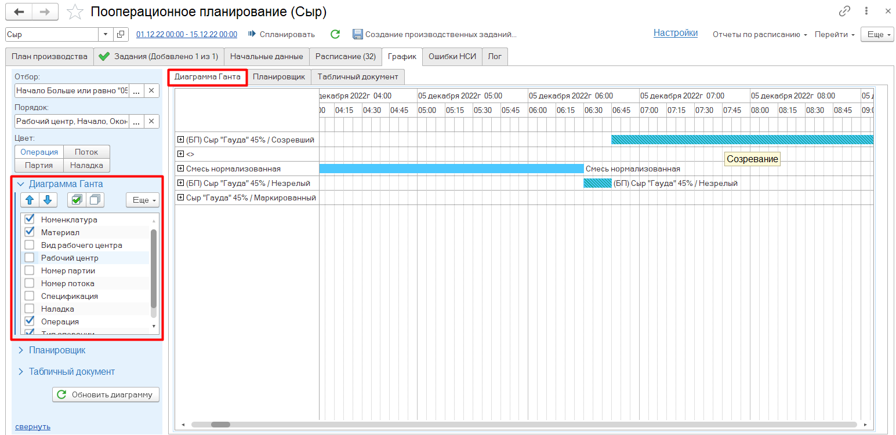
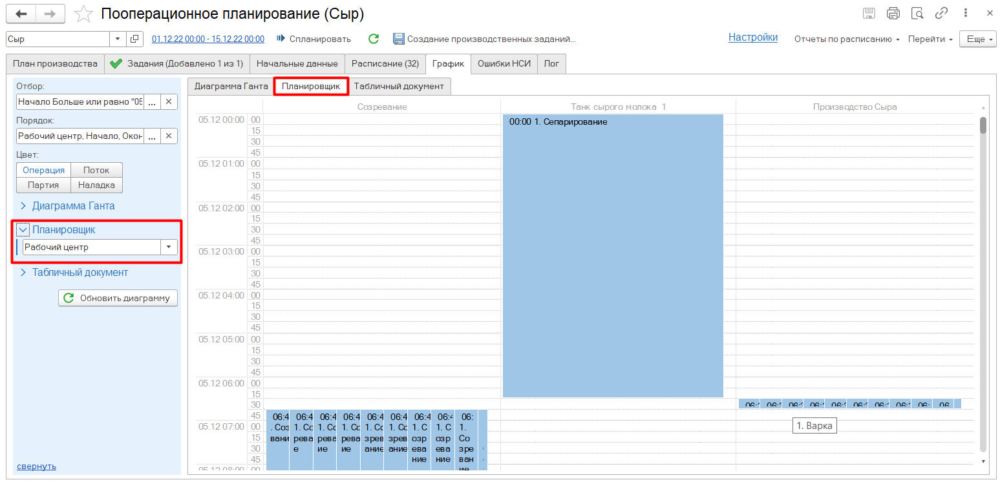
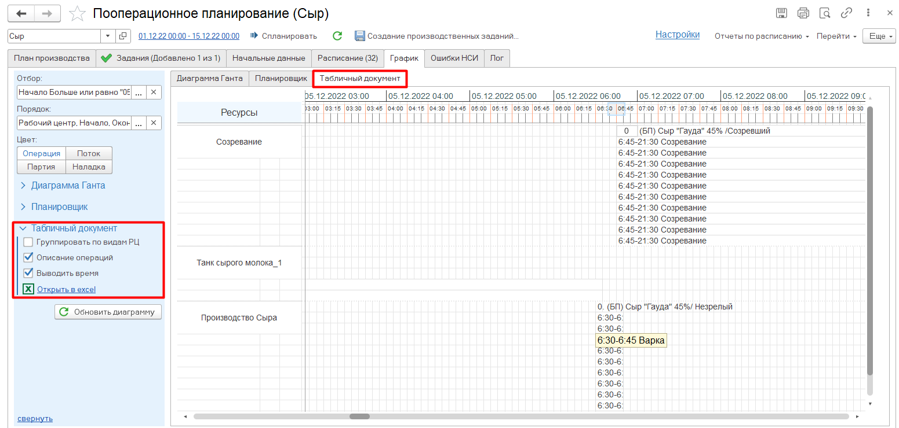
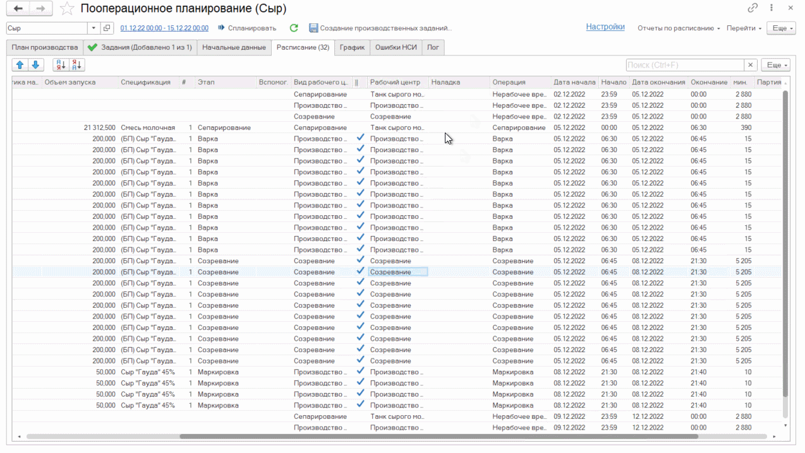

# Пооперационное планирование

АРМ **«Пооперационное планирование»** служит для распределения **«Заявки на производство»** по рабочим центрам и времени выпуска продукции, итоговым результатом является формирование документов **«Производственное задание»**.

АРМ Пооперационное планирование располагается в разделе **«Планирование»** подсистемы **«Операции»**.

На вкладке **«План производства»** необходимо открыть нужный документ **"Заявка на производство"**. 

Система заполнит табличную часть цепочкой производственных выпусков на основании данных Заявки на производство, Ресурсных спецификаций, Кратности партии и очередности Этапов производства.

**Важно!** Табличная часть заполняется только номенклатурой с типом: Готовая продукция, Базовый продукт, Полуфабрикат.

План производства возможно скорректировать вручную, разделив объем на несколько партий:

- По количеству - по соответствующей команде выделенная строка заявки производства разделяется на две партии с указанием объема новой партии и количеством запусков. 

- По запускам - по соответствующей команде выделенная строка заявки на производство разделяется на две партии с указанием количество запусков в новой партии. 

Скорректированный план производства возможно сохранить по команде **«Сохранить план в заявку»**. Заявка сохраниться в этапе документа, указанном в настройках. 

Пооперационное планирование происходит двумя способами:

**Поэтапное**. 

1)	Команда **«Заполнить задание»** на вкладке **«План производства»**. Заполняет вкладку **«Задания»** данными по всем [Этапам производства](SettingUpOperations.md) по количеству запусков с учетом [Кратности партии](PartyMultiplicity.md).

2)	Команда **«Заполнить расписание»** на вкладке **«Задания»**. В нижней части вкладки **«Задания»** появится результат добавления с плановым временем выполнения задания. Ошибки, полученные при планировании, будут отображаться в колонке **"Ошибки добавления"**. 

При успешном планировании на вкладке **«Расписание»** заполнится детальное расписание выполнения этапов по каждому запуску рабочих центров с учетом времени наладок, буферного времени и времени использования вспомогательных рабочих центов. Дополнительно заполнится нерабочее время по Производственному календарю. По команде **«Получить профиль»** на вкладке **«Задания»** расписание заполнится только производственными операциями.

**Автоматическое**.

- Команда **«Спланировать»**. Заполнение задания и планирование расписания, описанные выше, по одной команде.

При пооперационном планировании возможно учитывать дополнительные данные, которые указываются на вкладке **«Начальные данные»**.

Данные по Рабочим центрам:

- **Варианты наладок** - установить дополнительные варианты наладок для учета времени при планировании.
- **Параллельная работа** - При установке флага параметры параллельной работы будут использоваться из таблицы, иначе данные будут использоваться со справочника **«Виды рабочих центров»**. Автоматическое заполнение таблицы можно настроить в [Сценарии ППРЦ](ScenarioOperationalPlanning.md).

- **Остаток материалов** - устанавливается количество остатка материалов для использования объема при планировании.

Данные по НСИ:

- **Буфер** - устанавливается буферное время для всех операций или операций для конкретных видов рабочих центров или для конкретных рабочих центров. Буфер - это временной запас, который выделяется в планировании операций для учета возможных отклонений в сроках исполнения задач. Он предоставляет запас времени для учета непредвиденных ситуаций или изменений, чтобы сохранить план выполнения.

Графики работы:

- **Плановая недоступность** - возможность добавить время недоступности рабочих центров.

После формирования расписания на вкладке **«График»** информацию можно представить (отобразить/вывести) в виде:

- Диаграммы Ганта:

- Планировщика:

- Табличного документа:

По итогу распределения **"Заявки на производство"** по Рабочим центрам необходимо сформировать документы **"Производственные задания"**.

По команде **«Создание производственных заданий»** открывается предварительная форма, в которой отображаются данные документов **"Производственные задания"**, которые будут созданы по команде **"Создать документы"**. Предварительная форма открывается, если в настройках не указан флаг **"Создавать сразу"**.

При нажатии команды **«Создать документы»** формируются документы **«Производственное задание»**.

