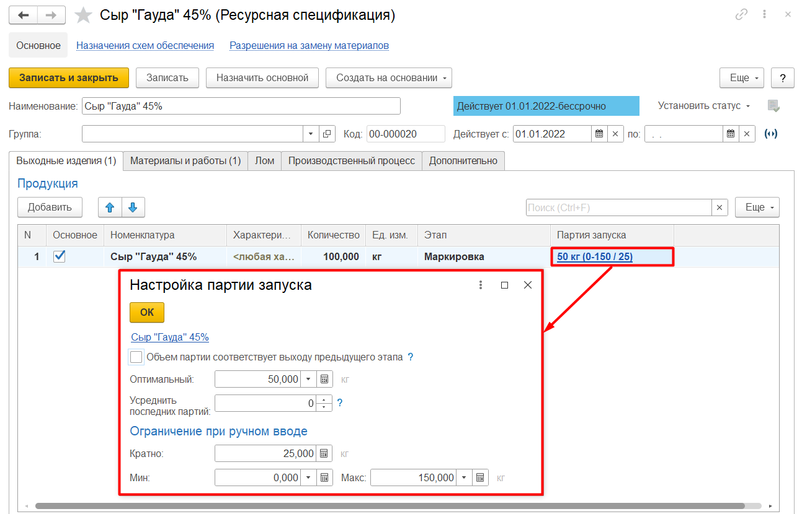

# Кратность партии

В **«Ресурсной спецификации»** необходимо заполнить кратность партии запуска для корректного расчета количества запусков при планировании.

В настройках партии запуска необходимо заполнить:

- Оптимальный объем запуска - количество выпуска продукции для одного замеса, используется при автоматическом делении по замесам в [АРМ "Пооперационное планирование"](OperationalPlanning.md).

- Количество последних партий для усреднения - количество последних партий, которое нужно усреднить, если количество оптимальных партий не входит в целое число. 

    - Например, если партия 300, а нужно 1000, то при усреднении= 1 партии: 300+300+300+**100**; 2 партии: 300+300+**200**+**200**; 3 партии: 300+**233**+**233**+**233**; При 0 усреднение не выполняется.

- Кратность партии - оптимальное, минимальное и максимальное количество выпуска продукции должно быть кратно заданному значению, используется при ручной корректировки плана производства.

- Минимальное количество в запуске - это минимальное количество продукции, которое может быть выпущено из одной партии запуска.

- Максимальное количество в запуске - это максимальное количество продукции, которое может быть выпущено из одной партии запуска.

