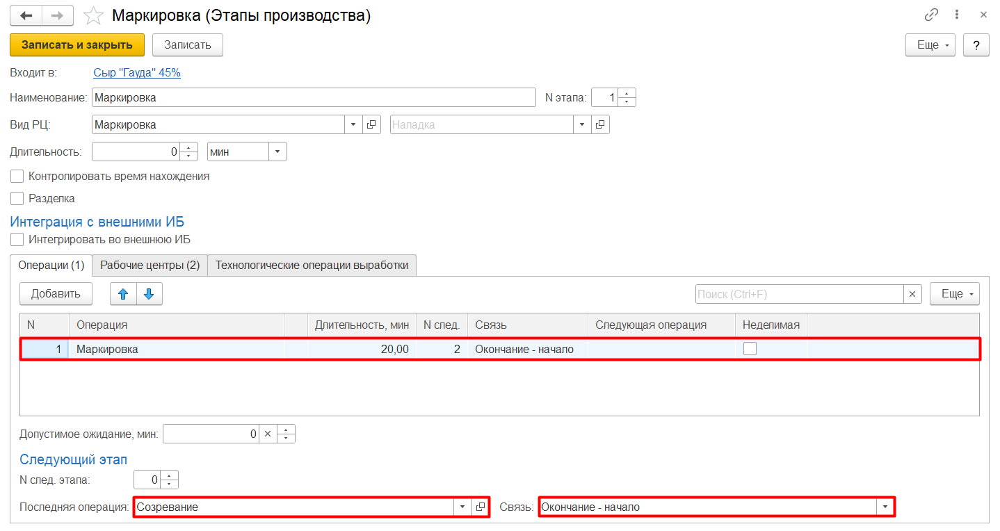
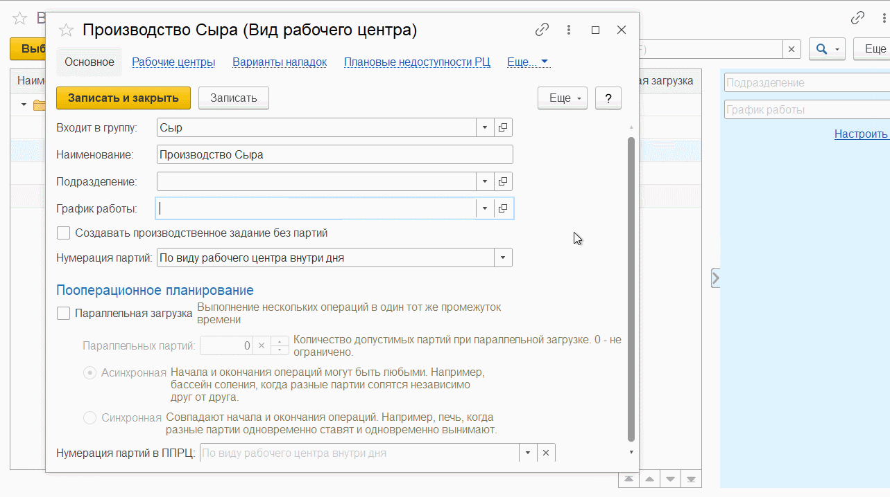

# Настройка операций в Этапах производства

Для корректного планирования производства необходимо заполнить данные в **"Этапах производства"**.

- Добавить **«Операцию»**
- Указать **«Последнюю операцию»** для цепочки производства
- Установить тип связи (типы позволяют определить последовательность операций и управлять ими):

    - **"Окончание - начало"** - тип связи, когда завершение одной операции является необходимым условием для начала следующей операции. 

    - **"Начало - начало"** - тип связи, который означает, что начало одной операции должно совпадать с началом другой операции. Таким образом, начало второй операции зависит от начала первой операции.

    - **"Окончание - начало (мягкий)"** - тип связи, который указывает на то, что начало второй операции может иметь небольшую погрешность во времени, но в основном должно совпадать с окончанием первой операции.

    - **"Начало - начало (мягкий)"** - тип связи, который указывает, что начало второй операции может немного отличаться от начала первой операции, но в целом должно совпадать. Этот тип связи может быть использован, когда необходимо учесть небольшую погрешность в времени начала операций.

- Заполнить **"График работы"** в справочнике **«Вид рабочего центра»** с заполненным Производственным календарем.

