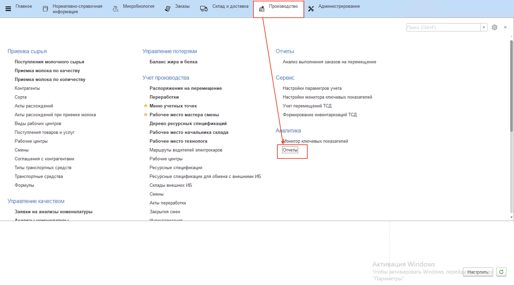
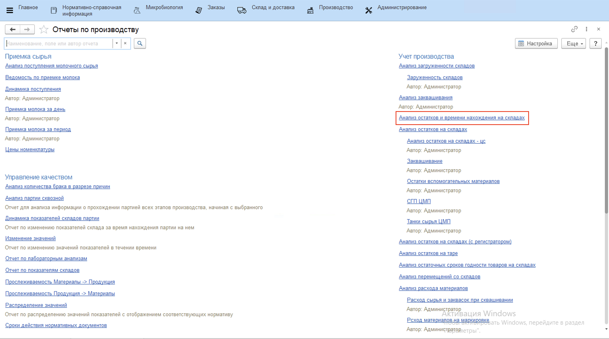
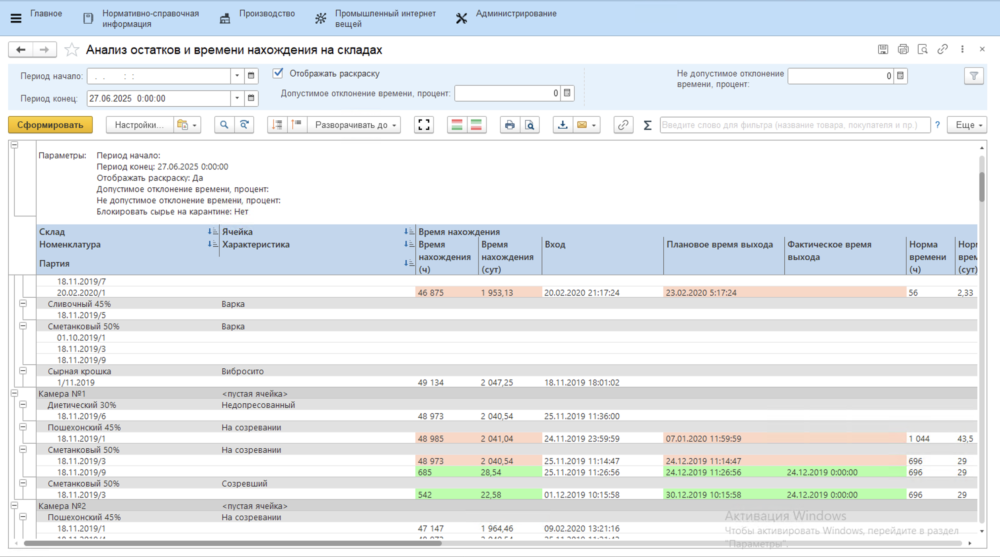

# Анализ перемещений со складов

Для анализа перемещений со складов предусмотрен отчет **"Анализ перемещений со складов"**. Отчет расположен в разделе **"Склад и доставка"** в подсистеме **"Аналитика"** - **"Отчеты"**.

Отчет предназначен для анализа расходов со склада в разрезе типа расхода и складов-получателей для перемещений.

Для формирования отчета:

- указать дату начала периода аналитики;
- указать дату окончания периода;
- указать склад, для которого анализируются расходы;
- нажать **"Сформировать"**.

В отчете отображается приход, расход (по разным типам), начальный и конечный остаток партий на выбранном складе в пределах указанного в параметрах периода.

Колонка **"Производство"** отражает расход, сформированный с помощью документов Переработка и Распределение материалов. Соответственно, это списания партий со склада напрямую на производство продукции.

Колонка **"Перемещение"** отражает расход, сформированный с помощью документов Распоряжение на перемещение. Расход указывается отдельно по каждому складу-получателю.

Колонка **"Утилизация"** отражает  расход, сформированный с помощью документов Списание товаров. Этот документ является результатом проведения инвентаризации на складе.

Колонка **"Недостача"** отражает расход, сформированный с помощью документов Оприходование товаров. Этот документ является результатом проведения инвентаризации на складе.

## Анализ остатков и времени нахождения на складах

Для анализа времени нахождения остатков на складе предусмотрен отчет **"Анализ остатков и времени нахождения на складах"**. Он расположен в разделе **"Производство"** в подсистеме **"Аналитика"** - **"Отчеты"**.

Отчет предназначен для анализа текущих остатков в камерах созревания, с их текущим состоянием, ОСГ, нормативным временем нахождения и т.д.

Для формирования отчета:

- указать дату начала периода аналитики;
- указать дату окончания периода;
- нажать **"Сформировать"**.

В отчете отображается приход, расход (по разным типам), начальный и конечный остаток партий на складах в пределах указанного в параметрах периода. Также фиксируется время входа каждой партии на склад, время выхода, если оно имеется, и время нахождения партии на складе. Если партия не покидала склад, то время нахождения рассчитывается относительно конца указанного периода. Данные параметры сравниваются с нормативом и подсвечиваются соответствующим цветным маркером.

Колонки **"Время нахождения"** отражает в часах и в сутках время, в течение которого партия находилась на складе. Оно рассчитывается, как разница между временем входа и выхода партии или же, как разница между временем входа и концом указанного периода.

Колонка **"Вход"** отражает дату и время документа, создающего приход партии на склад.

Колонка **"Плановое время выхода"** отражает дату и время выхода партии, рассчитывающиеся по норме относительно даты входа.

Колонка **"Фактическое время выхода"** отражает дату и время документа, создающего расход партии на складе.

Колонки **"Норма времени"** отражает в часах и в сутках норматив нахождения партии на складе и подставляется из спецификации. 