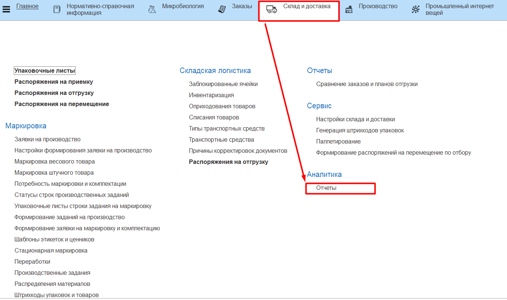
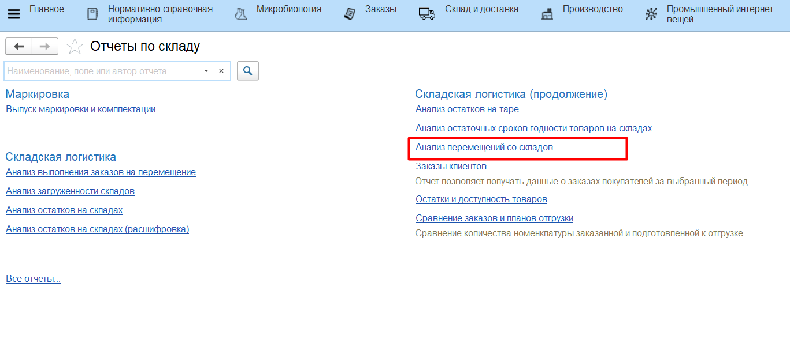
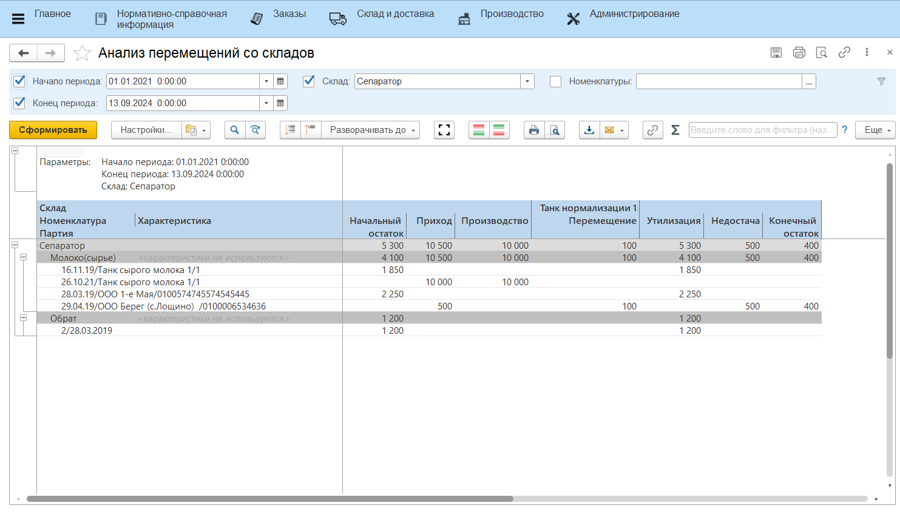

# Анализ перемещений со складов

Для анализа перемещений со складов предусмотрен отчет **"Анализ перемещений со складов"**. Отчет расположен в разделе **"Склад и доставка"** в подсистеме **"Аналитика"** - **"Отчеты"**.

Отчет предназначен для анализа расходов со склада в разрезе типа расхода и складов-получателей для перемещений.

Для формирования отчета:

- указать дату начала периода аналитики;
- указать дату окончания периода;
- указать склад, для которого анализируются расходы;
- нажать **"Сформировать"**.

В отчете отображается приход, расход (по разным типам), начальный и конечный остаток партий на выбранном складе в пределах указанного в параметрах периода.

Колонка **"Производство"** отражает расход, сформированный с помощью документов Переработка и Распределение материалов. Соответственно, это списания партий со склада напрямую на производство продукции.

Колонка **"Перемещение"** отражает расход, сформированный с помощью документов Распоряжение на перемещение. Расход указывается отдельно по каждому складу-получателю.

Колонка **"Утилизация"** отражает  расход, сформированный с помощью документов Списание товаров. Этот документ является результатом проведения инвентаризации на складе.

Колонка **"Недостача"** отражает расход, сформированный с помощью документов Оприходование товаров. Этот документ является результатом проведения инвентаризации на складе.