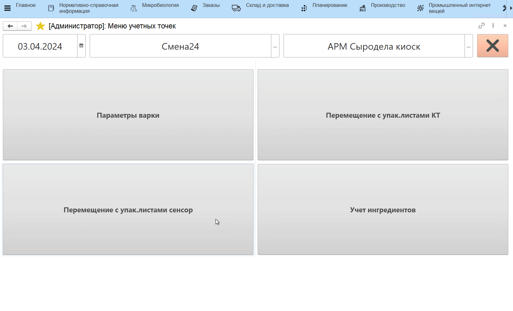
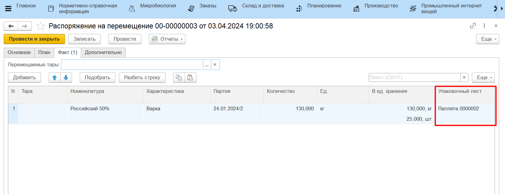
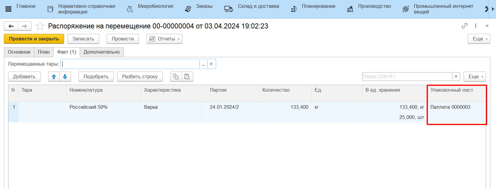

# Формирование упаковочного листа и перемещение

Если какую-либо продукцию необходимо укомплектовать на таре (паллете) с формированием упаковочного листа и переместить, то это можно сделать на киоске в созданной учетной точке.

Для этого необходимо:

- Открыть **"Меню учетных точек"**, выбрать дату смены, смену и рабочий центр;
- Нажать кнопку **"Перемещение"**;
- В открывшейся форме выбрать остаток материала, который будут складывать на тару (паллету), нажать **"Выбрать"**. Откроется форма приемки и передачи;

Если **НЕ** используется калькулятор тары:

- Поставить новую тару (паллету) на весы, зафиксировать вес;
- Переложить продукцию на тару (паллету), зафиксировать вес брутто. Вес нетто рассчитается автоматически;
- Нажать **"Подтвердить"**.

Если используется калькулятор тары:

- Открыть калькулятор тары, выбрать из списка тару (паллету), которая используется для упаковочных листов, и дополнительную тару при необходимости;
- Переложить продукцию на тару (паллету), поставить на весы, зафиксировать вес брутто. Вес нетто рассчитается автоматически;
- Нажать **"Подтвердить"**.

По итогу будет сформирован документ **"Упаковочный лист"**, содержащий информацию о весе паллетированной продукции, а также документ **"Распоряжение на перемещение"** для перемещения тары (паллеты) на склад-получатель.

Если в системе ведется [Детальный учет по упаковочным листам](../../../../Warehouse/LocationOfContainers/LocationPackageLists.md), то дополнительно будет сформирован документ **"Комплектация упаковочного листа"** с типом "Собрать", который запишет взвешенную продукцию на созданную паллету.

!!! info "Важно"
    - Нельзя укомплектовать на одну тару несколько разных продукций/партий;
    - Нельзя укомплектовать сырье, которое лежит на многооборотной таре. 