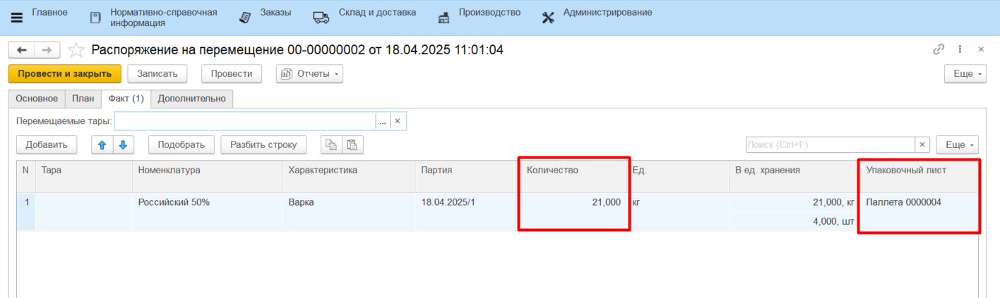
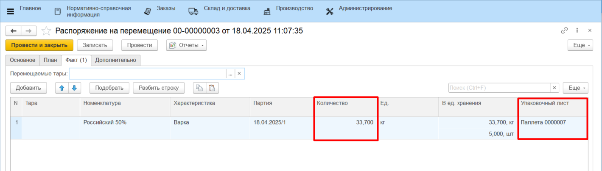

# Частичное перемещение

Если на какую-либо продукцию, находящуюся на таре (паллете), уже сформирован упаковочный лист, и теперь **часть продукции** с этой тары нужно переместить на другой склад производства, предлагается воспользоваться частичным перемещением. 

Для этого необходимо:

- Открыть **"Меню учетных точек"**, выбрать дату смены, смену и рабочий центр;
- Нажать кнопку **"Перемещение"**;
- В открывшейся форме отсканировать упаковочный лист тары (паллеты), с которой нужно снять продукцию. Откроется форма приемки и передачи;
- Из предложенных вариантов выбрать **"Частичное перемещение"**;

Если **НЕ** используется калькулятор тары:

- Поставить новую тару (паллету) на весы, зафиксировать вес;
- Переложить часть продукции на новую тару (паллету), зафиксировать вес брутто. Вес нетто рассчитается автоматически;
- Нажать **"Подтвердить"**.

Если используется калькулятор тары:

- Открыть калькулятор тары, выбрать из списка тару (паллету), которая используется для упаковочных листов, и дополнительную тару при необходимости;
- Переложить часть продукции на новую тару (паллету), поставить на весы, зафиксировать вес брутто. Вес нетто рассчитается автоматически;
- Нажать **"Подтвердить"**.

По итогу будут сформированы:

- новый упаковочный лист, содержащий информацию о перемещаемой части продукции;
- новый упаковочный лист, содержащий информацию об остатке продукции на старой таре (паллете);
- документ **"Распоряжение на перемещение"** для перемещения новой тары (паллеты) на склад-получатель.

Если в системе ведется [Детальный учет по упаковочным листам](../../../../Warehouse/LocationOfContainers/LocationPackageLists.md), то будут сформированы документы:

- новый упаковочный лист, содержащий информацию о перемещаемой части продукции;
- **"Комплектация упаковочного листа"** с типом "Собрать", который запишет взвешенную продукцию на созданную паллету;
- **"Комплектация упаковочного листа"** с типом "Пересобрать", который актуализирует остаток на старом упаковочном листе;
- документ **"Распоряжение на перемещение"** для перемещения новой тары (паллеты) на склад-получатель.

!!! info "Важно"
    - Нельзя делить/перемещать политоварные паллеты;
    - Нельзя делить/перемещать сырье, которое лежит на многооборотной таре;
    - При разделении паллеты на новой таре нельзя взвесить сырье больше по весу, чем было указано в изначальном упаковочном листе;
    - При разделении паллеты нельзя указать вес дополнительной тары (при использовании калькулятора тары) больше, чем было указано в изначальном упаковочном листе.