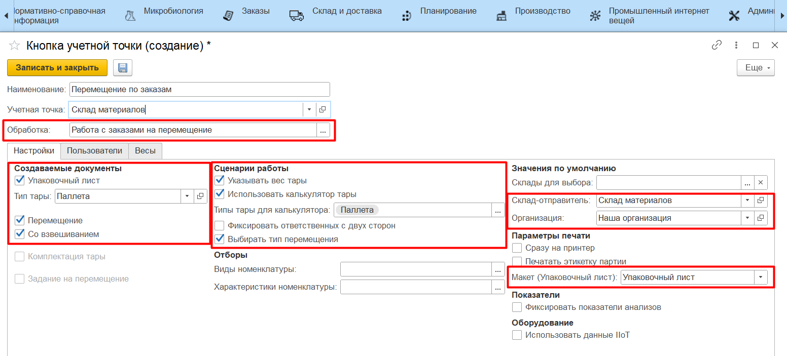
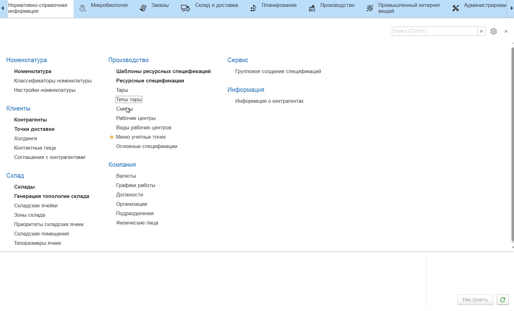

# Настройка кнопки "Перемещение по заказам"

Кнопка **"Перемещение по заказам"** используется для передачи материалов между складами материалов и складами производства.

При создании кнопки учетной точки **"Перемещение по заказам"** указываются:

- Наименование;
- Учетная точка;
- Обработка - Работа с заказами на перемещение;

На вкладке **"Настройки"** заполняются:

| Блок | Параметр | Описание |
|----------|---------|---------|
| Создаваемые документы | Перемещение | Включает операцию перемещения, по итогу работы формируется документ "Распоряжение на перемещение" |
| | Со взвешиванием | Позволяет через киоск отразить перемещение тары/партии, изменяя перемещаемое количество. Если опция не включена, выбранное на киоске количество остатка будет перемещено полностью без возможности перевзвешивания |
| | Упаковочный лист | По итогу работы формируется документ "Упаковочный лист" |
| | Тип тары | С каким типом тары будет создаваться документ "Упаковочный лист" |
| Сценарии работы | Указывать вес тары | Завешивание происходит на таре. Чтобы получить точный вес продукции нужно из общего веса вычитать вес тары |
| | Использовать калькулятор тары | Отображается, когда включено указание веса тары. Можно указать вес тары в виде составных частей с заданным в системе фиксированным весом |
| | Типы тары для калькулятора | Отображается, когда включено использование калькулятора тары. Ограничивает список типов тар в калькуляторе |
| | Фиксировать ответственных с двух сторон | При подтверждении перемещения на киоске необходимо сканирование бейджей ответственных за операцию со склада-отправителя и склада-получателя |
| | Выбирать тип перемещения | Позволяет выбирать тип перемещения на киоске - [полное](FullMoving.md) или [частичное без перевзвешивания](PartMoving.md) |
| Значения по умолчанию | Склады для выбора | Ограничивает список складов-получателей для перемещения |
| | Склад-отправитель | Откуда перемещается продукция |
| | Организация | Текущая организация |
| Параметры печати | Печать сразу на принтер | Включает/отключает печать сразу на принтер. Включенная опция позволяет печатать выбранный документ без предварительного вывода на экран |
| | Макет (Упаковочный лист) | Что именно будет печататься на паллету |

На вкладке **"Пользователи"** можно настроить индивидуальные права доступа на данную команду.

**Важно!** Если на учетной точке предполагается использование калькулятора тары для выбора тары фиксированного веса из списка, то чтобы паллета (поддон) или любая другая тара, которую используют для упаковочного листа, была так же доступна для выбора в калькуляторе, необходимо:

- в справочнике **"Типы тар"** создать новую или выбрать существующую тару, которую будут использовать для формирования упаковочных листов;
- указать наименование, поставить галочку "Используется для упаковочных листов";
- поставить галочку "Фиксированный вес" и указать вес тары;
- сохранить.

Затем при создании учетной точки в настройках необходимо указать созданный тип тары в качестве типа тары для упаковочных листов, а также выбрать его в качестве допустимого типа тары для калькулятора.