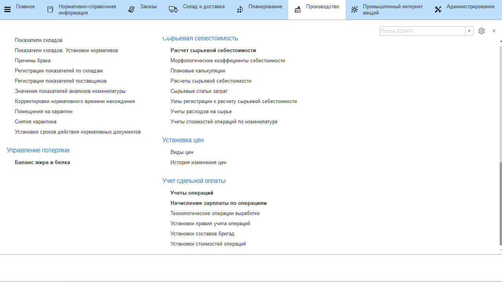

# Операции выработки

Информация об операциях выработки, которые вычисляются объемами
произведенной продукции (или зависят от этого объема) хранится в
справочнике **"Технологические операции выработки"**.

-   Открыть справочник и перейти к созданию нового элемента$
-   Указать название;
-   Указать, от чего зависит объем выработки по данной операции:
    -   На документ - количество созданных документов (возможно, применимо в
    случае выпуска варок сыра. Чтобы учитывать именно их количество, а
    не вес или штуки);
    -   На единицу материала - когда объем считается не по продукции, а по
    материалу (кг);
    -   На доп.единицу материала - аналогично первому, но применимо только
    для материалов с двумя единицами измерения, считается по второй
    (штуки);
    -   На единицу продукции - считается объем выпущенной продукции (кг);
    -   На доп.единицу продукции - считается объем выпущенной продукции, но
    в доп.единицах (штуки);
-   Указать, каким образом учитывается выработка по этой операции:
    -   Бригадная - полученный объем распределяется между установленной на
    участок бригадой;
    -   Индивидуальная - полученный объем идет одному исполнителю;
    -   Бригадный по спецификации - эти операции используются в привязке к
    спецификациям, распределяются всегда на установленную на участок
    бригаду;  
-   Нажать **"Записать и закрыть"**.

