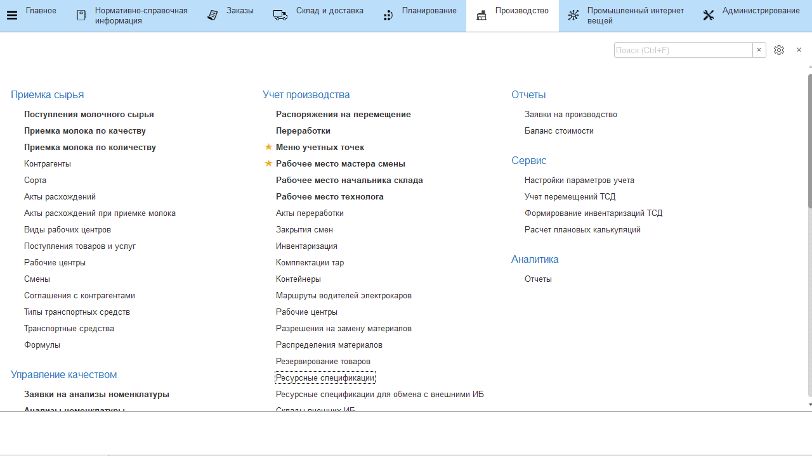

# Ресурсные спецификации

Набор операций выработки, которые связаны непосредственно с выпуском
продукции на разных этапах производтсва (только для документов
**"Переработки"**), должны быть указаны в соответствующих этапах
спецификаций продукции.

-   Открыть справочник **"Ресурсные спецификации"**. 
-   Перейти к редактированию нужной рецептуры;
-   Выбрать нужный этап и перейти в нем в таблицу **"Операции выработки"**;
-   Указать те операции выработки, которые совершаются при выпуске
    продукции на этом этапе;
-   Нажать **"Записать и закрыть"**.

