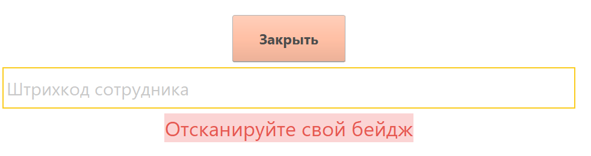
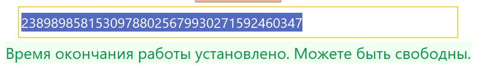

# Уход с рабочего места раньше положенного

Бывают ситуации, когда сотрудникам требуется "аварийно" покинуть свое
рабочее место - дела или иные важные обстоятельства. Учесть свой уход в
системе сотрудник может не отходя от своего рабочего места.

-   В **"Меню учетных точек"** на рабочем месте каждого сотрудника можно настроить специальную учетную точку. Делается это с помощью настройки кнопок учетных точек (обработка *"Формирование составов бригад"*):

-   При нажатии откроется окно сканирования бейджа сотрудника:
  

-   Просканировать свой бейдж (или, если не подключен сканер, вбить
    индивидуальный номер):

-   Готово, можете покинуть рабочее место:
  
