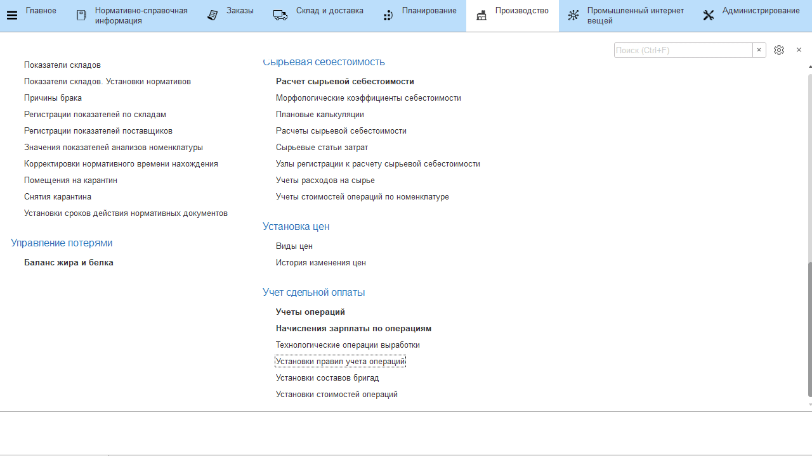
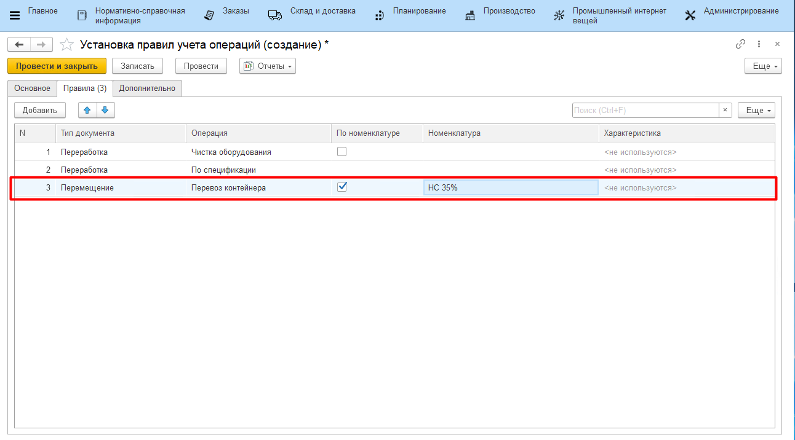

# Установка правил учета выработки

Привязка к действиям, совершаемым через киоски (через обработку **"Меню учетных точек"**), определенных операций выработки осуществляется документом **"Установка правил учета выработки"**.

-   Открыть документы **"Установка правил учета выработки"** и перейти к
    созданию нового; 
-   Указать кнопку учетной точки, для которой задается правила учета
    выработки;
-   Указать начало действия правила и, при необходимости, окончание;
-   Перейти на вкладку **"Правила"** и добавить новое;
-   Указать, для какого документа, создаваемого из соответствующей кнопки учетной точки, будет задаваться это правило;
-   Указать, какая операция выработки будет учитываться выбранным документом;

> Важно заметить, что если для документа **"Переработка"** выбрать предопределенный элемент **"По спецификации"**, правилом будут подтягиваться все операции выработки, указанные в спецификации создаваемых документов **"Переработка"**:      

    

-   Можно разделить операции в рамках разных номенклатур. Например, одна операция будет считаться по документу **"Переработка"** для одних 
    номенклатур, другая операция - для других, но тоже документом "Переработка". Для этого устанавливать галочку "По номенклатуре", затем указывать, по какой именно: 

  

-   Нажать **"Провести и закрыть"**.