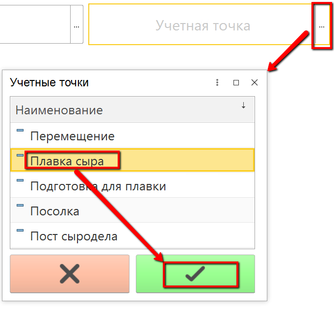
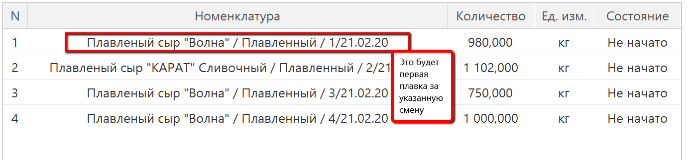
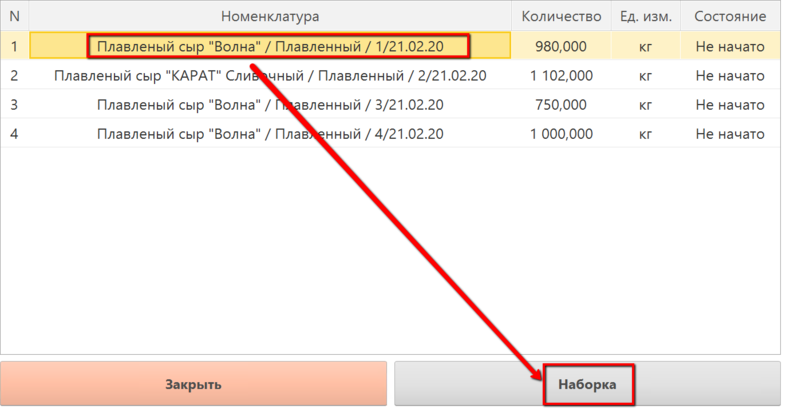
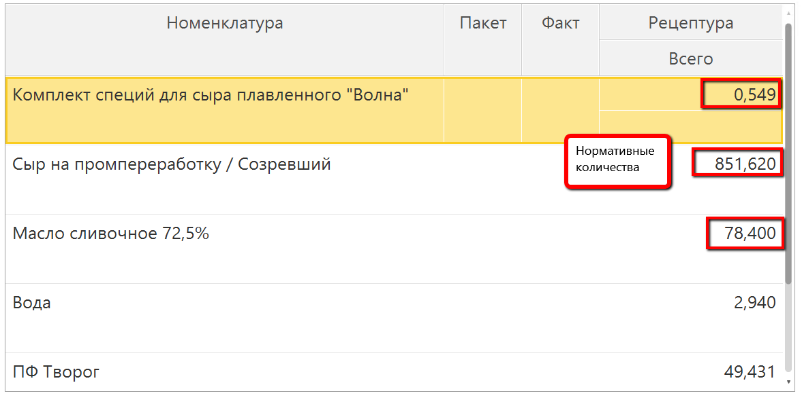
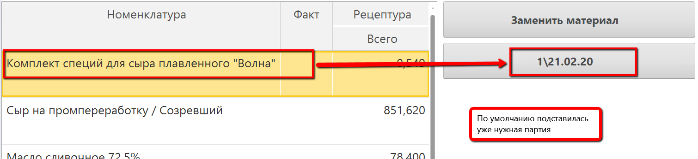
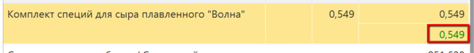
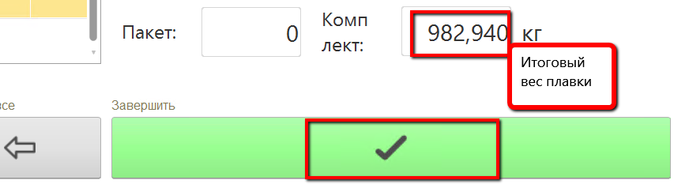

# Учет выпуска плавленного сыра

Выпуск плавки сыра идет по заданию на смену, объем полученного сыра в
системе формируется как сумма всех ингредиентов, которые были в него
заложены. Учет внесенных ингредиентов может проходить как вручную (если
к киоску не подключены весы), так и непосредственно с использованием
весов.

 

 

-   Открыть "Меню учетных точек":  
    
     
-   Указать дату и смену, если они еще не указаны:  
    
     
-   Указать учетную точку, отвечающую за участок, где учитывается
    количество ингредиентов, отправленных под конкретную плавку сыра:  
    
     
-   Нажать кнопку, соответствующую операции учета ингредиентов.
    Откроется окно с заданием на текущую смену:  
    
    
-   Выбрать нужную плавку и нажать "Наборка":   
    
 
-   Откроется окно учета ингредиентов. По умолчанию таблица ингредиентов
    заполняется из рецептуры, для каждого ингредиента указано его
    нормативное количество:    
    
     
-   Выбрать первый ингредиент. Указать его партию:  
    
     
-   Положить на весы и нажать кнопку получения с весов (или ввести
    вручную это значение).
    
-   При попадании в норму, вес фиксируется напротив ингредиента:  
    
     
-   Завесить все остальные ингредиенты, нажать кнопку завершения учета:  
    
     
-   Сформируется выпуск с объемом = сумме всех ингредиентов, в него
    заложенных.
     

