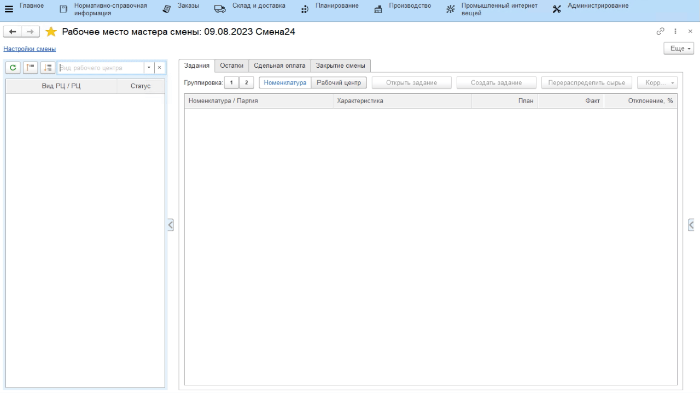
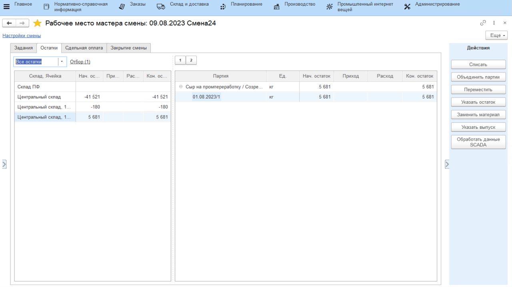

# Поступление сырья

Поступление полуфабрикатов и материалов для плавки сыра в системе
фиксируется документом **"Распоряжение на перемещение"**. При этом важно
разделять поступления ПФ от поступлений материалов: 1) проще искать в
документах, когда эти два вида разделены; 2) обычно склад ПФ и
склад материалов - физически разные помещения.

Пример поступления материалов можно посмотреть в разделе "Варка" -\> "[Учет заквасок и прочих ингредиентов](../../SemiHardCheese/CookingCheese/AccountingSourdoughAndOthers/MovingWithWarehouse/MovingWithWarehouse.md)".

Поступление ПФ делается аналогично (разница в складе-получателе и в
передаваемых товарах). Если же чаще всего бывает так, что передается
всего одна партия ПФ за довольно большой промежуток времени, то эту
операцию можно выполнять через **"Рабочее место мастера смены"**.

-   Открыть **"Рабочее место мастера смены"**;
-   Указать дату и смену;
-   Указать участок, на котором подготавливается сырье для плавленного сыра;
-   Выбрать участок приемки сырья в таблице ниже;
-   Перейти на вкладку *"Остатки"*:

-   Найти в таблице на складе, с которого перемещается сырье, партию, которую нужно переместить в помещение подготовки сырья, и нажать **"Переместить"**;
-   Указать, куда и сколько перемещается сырья;
-   Подтвердить:  

