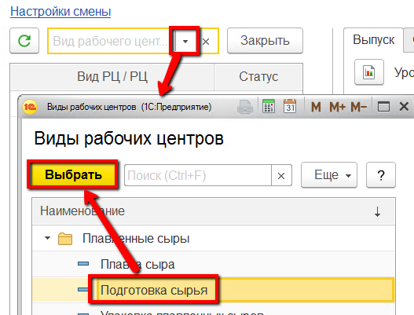
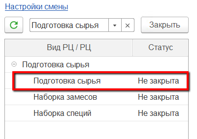
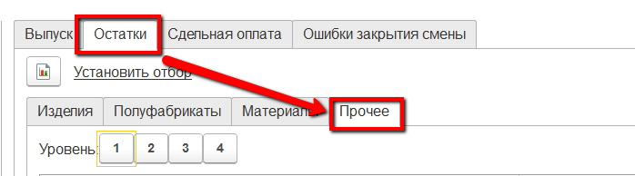
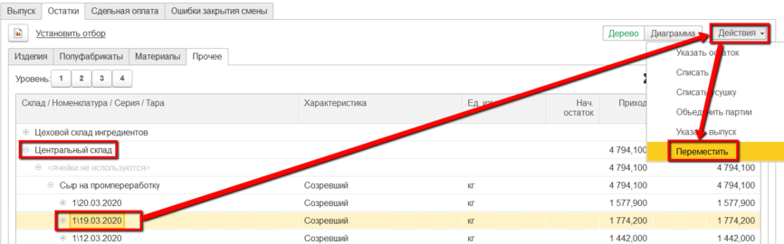
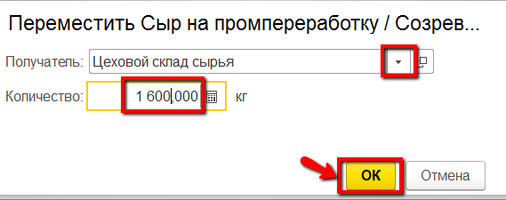

# Поступление сырья

Поступление полуфабрикатов и материалов для плавки сыра в системе
фиксируется документом "Распоряжение на перемещение". При этом важно
разделять поступления ПФ от поступлений материалов: 1) проще искать в
документах, когда эти два вида разделены 2) скорее всего, склад ПФ и
склад материалов - физически разные помещения.

 

 

Пример поступления материалов можно посмотреть в разделе "Варка" -\> "[Учет заквасок и прочих ингредиентов](../../SemiHardCheese/CookingCheese/AccountingSourdoughAndOthers/MovingWithWarehouse/MovingWithWarehouse.md)".

Поступление ПФ делается аналогично (разница в складе-получателе и в
передаваемых товарах). Если же чаще всего бывает так, что передается
всего одна партия ПФ за довольно большой промежуток времени, то эту
операцию можно выполнять через "Рабочее место мастера смены".

 

-   Открыть "Рабочее место мастера смены":  
    
     
-   Указать дату и смену:  
    
     
-   Указать участок, на котором подготавливается сырье для плавленного
    сыра:  
    
    
-   Выбрать участок приемки сырья в таблице ниже:  
    
     
-   Заполнится различная информация по вкладкам справа. Перейти на
    вкладку "Остатки" -\> "Прочее":  
    
     
-   Найти в таблице на складе, с которого перемещается сырье в цех,
    партию, которую нужно переместить в помещение подготовки сырья, и
    нажать "Переместить":  
    
     
-   Указать, куда и сколько перемещается сырья, подтвердить:  
    

