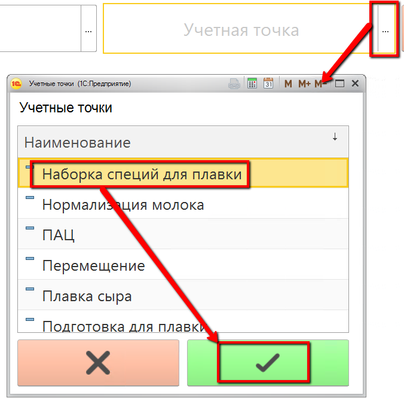
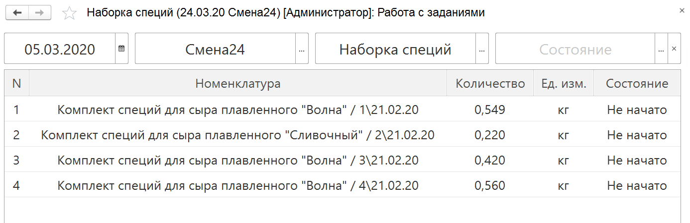
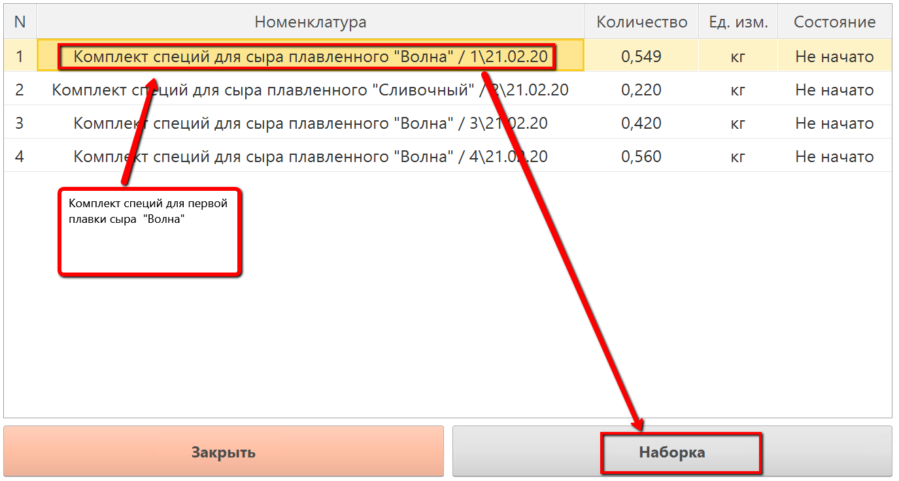
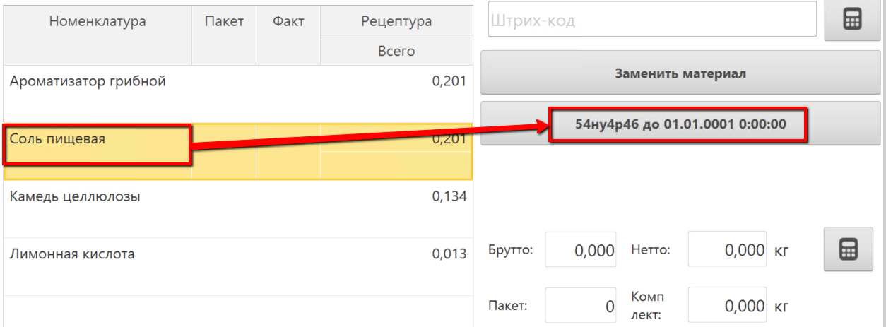
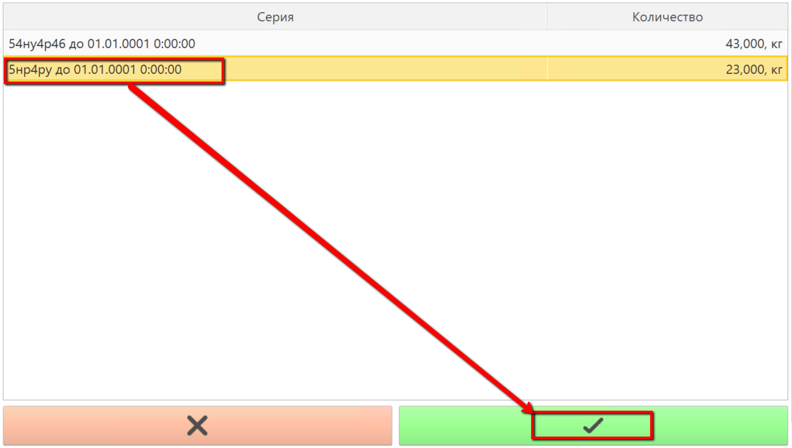
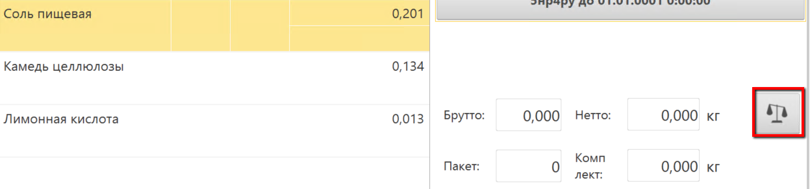
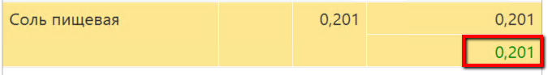
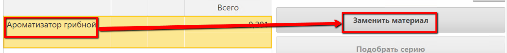
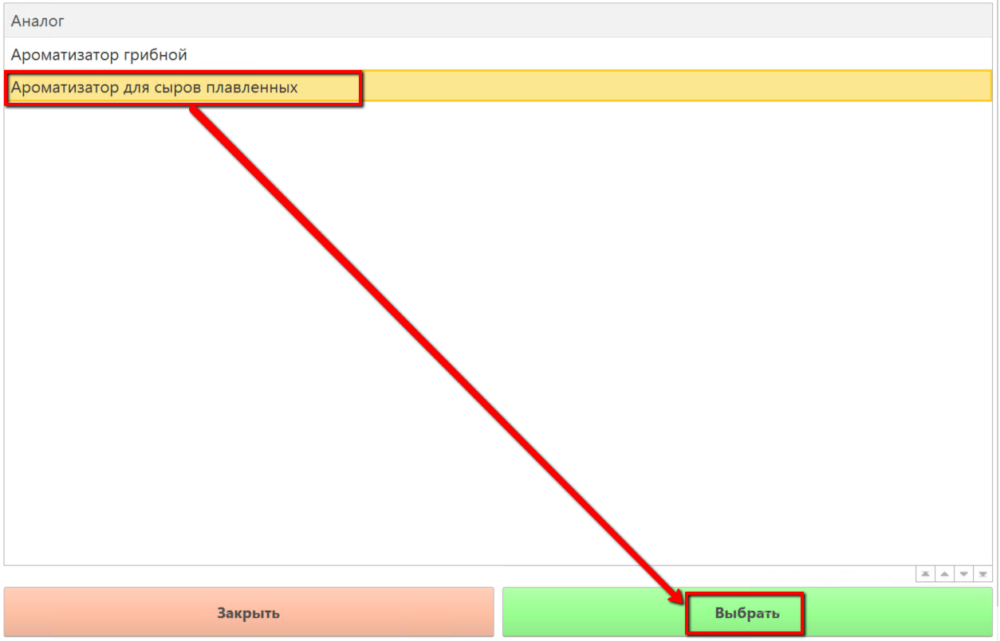
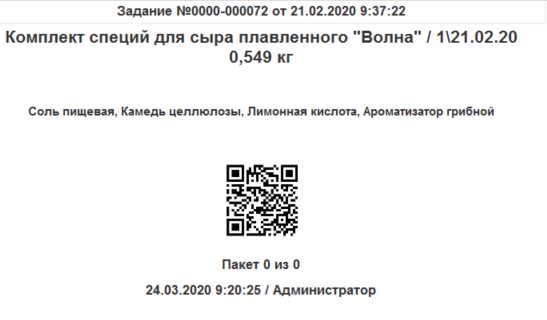

# Комплектация сыпучих ингредиентов

Под каждую плавку сыра нужно набирать комплект специй (если таковой
имеется для сыра). Наборка специй происходит с использованием киоска и
подключенных к нему весов через "Меню учетных точек".

 

 

-   Открыть "Меню учетных точек":  
    
     
-   Указать дату и смену, если они еще не указаны:  
    
     
-   Указать учетную точку, отвечающую за участок, где набираются
    комплекты специй:  
    
     
-   Нажать на соответствующую наборке кнопку. Откроется окно с заданием
    на наборку специй:  
    
     
-   Выбрать нужную строку задания и нажать "Наборка":  
    
     
-   Откроется окно набора специй. По умолчанию таблица заполняется
    ингредиентами из рецептуры. Для каждого ингредиента указано
    нормативное количество для комплекта. Выбрать в таблице первый
    набираемый ингредиент и указать его используемую партию (если
    ведется учет по ним):  
      
    
     
-   Положить на весы нужное количество и нажать кнопку получения веса с
    весов:  
    
     
-   При попадании в норматив вес в таблице зафиксируется:  
    
     
-   Если используется ингредиент не по рецептуре, а его аналог, нажать
    "Заменить материал" и выбрать аналог:  
      
    

-   Выбрать партию аналога и также завесить его.
-   По итогу наборки всего комплекта печатается этикетка с указанием
    состава и штрихкодом для его дальнейшей идентификации:  
    
     
-   Завершить наборку комплекта:  
    

