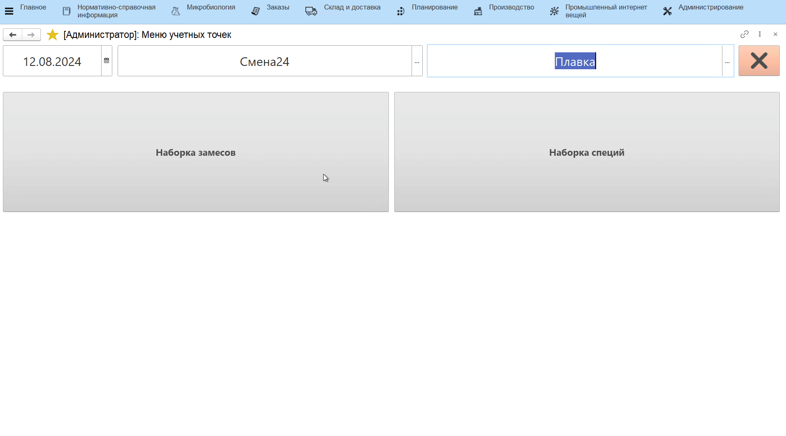

# Наборка замесов

Под каждую плавку сыра нужно набирать комплект сырья. Наборка комплектов
происходит с использованием киоска и подключенных к нему весов через
**"Меню учетных точек"**.

- Открыть **"Меню учетных точек"**;
- Указать дату и смену, если они еще не указаны;
- Указать учетную точку, отвечающую за участок, где набираются комплекты сырья;
- Нажать на соответствующую наборке кнопку. Откроется окно с заданием на наборку комплектов сырья;
- Выбрать нужную строку задания и нажать **"Наборка"**;
- Откроется окно набора комплекта. Таблица заполняется ингредиентами из выданной рецептуры. Для каждого ингредиента указано нормативное количество для комплекта. Выбрать в таблице первый набираемый ингредиент и указать его используемую партию;
- Положить на весы нужное количество и нажать кнопку получения веса с весов или ввести вес вручную;
- При попадании в норматив вес в таблице зафиксируется. При необходимости можно выбрать несколько партий используемого материала. Для этого после взвешивания первой партии необходимо повторно открыть форму подбора и выбрать вторую партию, далее произвести ее взвешивание. При этом на форме подбора партии будет видно, какие партии и в каком количестве (колонка "Набрано") были использованы в данной наборке.    

- По итогу наборки всего комплекта печатается этикетка с указанием состава и штрихкодом для его дальнейшей идентификации;
- Завершить наборку комплекта по кнопке с галочкой:  

