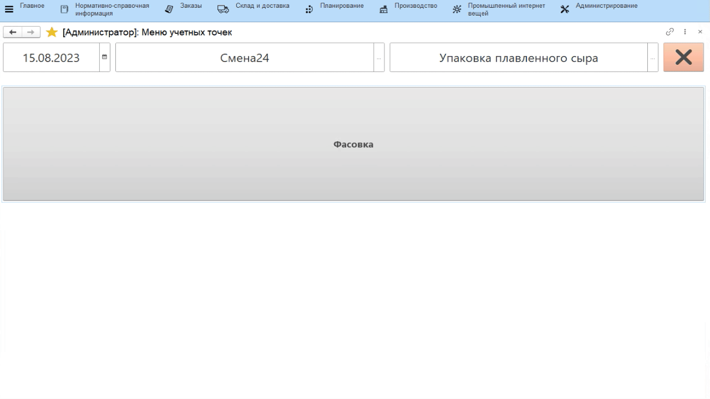
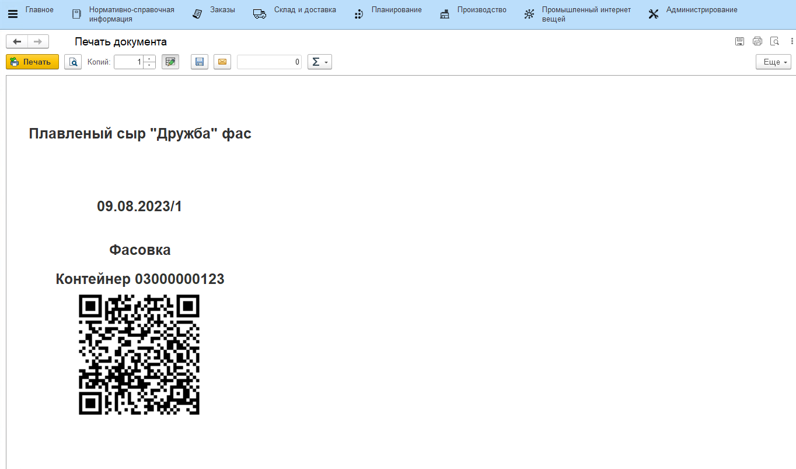

# Фасовка и передача на охлаждение

Готовый сыр фасуют и передают на охлаждение, при этом помечая рол-кейсы,
на которые сыр укладывается, специальными этикетками для дальнейшей
идентификации.

-   Открыть **"Меню учетных точек"**;
-   Указать дату и смену, если они еще не указаны;
-   Указать учетную точку, отвечающую за участок, где сыр упаковывается
    и передается на охлаждение;
-   Нажать кнопку, отвечающую за выпуск упакованного сыра и передачи его
    на охлаждение;  
-   Откроется таблица с остатками на складе плавки. Выбрать ту, которая
    упаковывается в текущий момент и нажать **"Выбрать"**;
-   Указать склад-получатель (если еще не указан в настройках кнопки учетной точки);
-   Указать, в какой пакет упаковывается сыр и партию пакета, если
    ведется учет;
-   Указать количество кг и штук, переданное на охлаждение;

-   Подтвердить. По итогу печатается этикетка для ролл-кейса, на который
    укладывается сыр. Наклеить её и отправить на охлаждение:  

