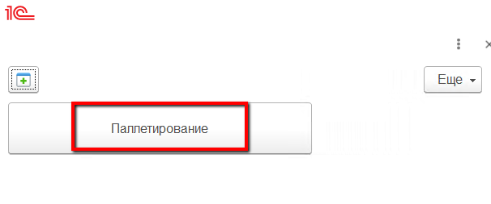
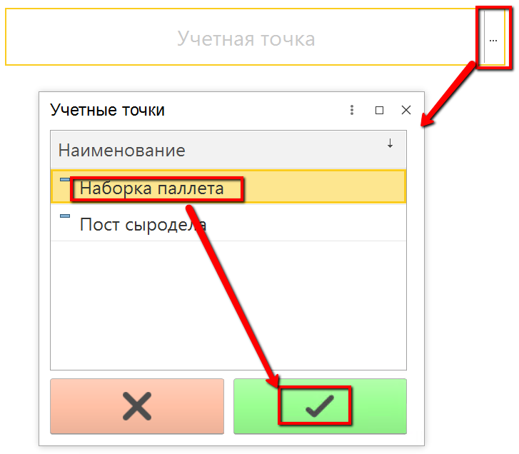
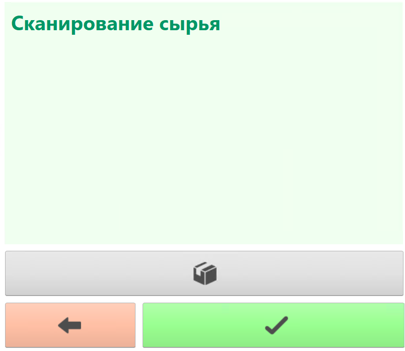
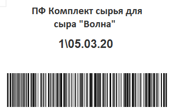
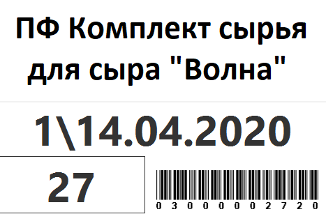
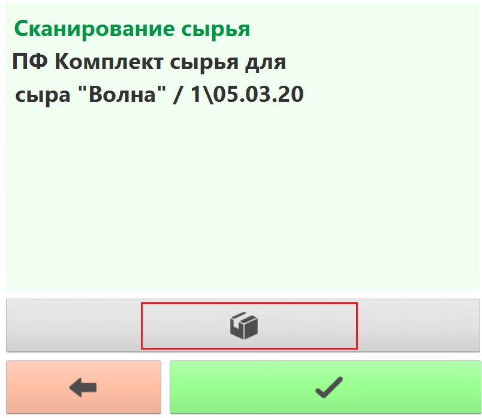
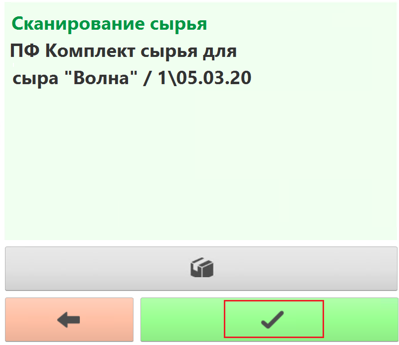
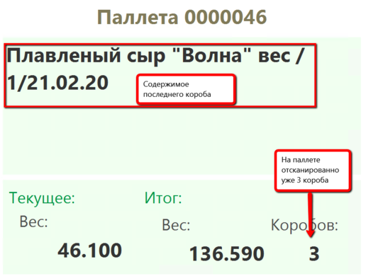
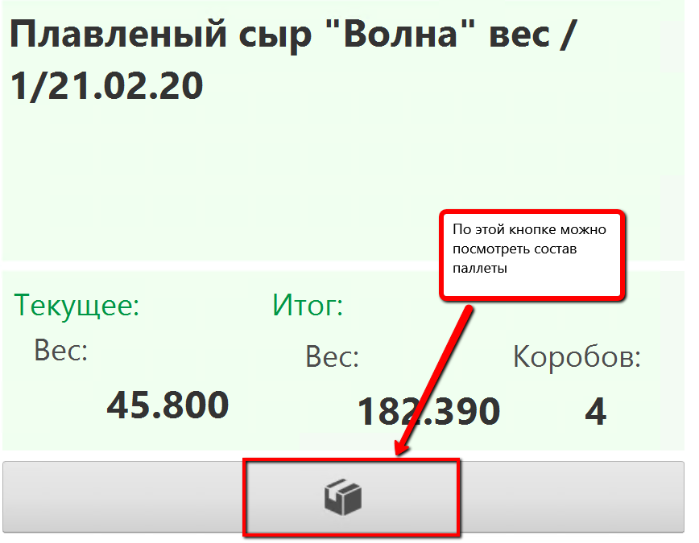

# Паллетирование коробов

Сыр был уложен в короба и промаркирован через специальное оборудование,
а в системе нужно учесть эту упаковку. Для такой операции удобнее всего
использовать ТСД (Терминал сбора данных), с помощью которого и будут
сканироваться этикетки коробов.

 

 

-   Для ТСД настраивается стартовая страница с кнопками для сенсорного
    управления. Нажать кнопку для учета паллетирования:  
    
     
-   Указать дату и смену, если они еще не указаны:  
    
     
-   Указать учетную точку, отвечающую за участок, где идет
    паллетирование:  
    
     
-   Нажать кнопку, соответствующую набору паллеты. 

<h4> Сканирование сырья </h4>

Если опция сканирования сырья отключена в системе, то пропустить этот раздел. 

- Откроется форма сканирования сырья:

- Просканировать этикетку партий или контейнеров, с которого было взято сырье на выпуск. Примерный вид этикеток:
    - Этикетка партии:  
    
    - Этикетка контейнера:  
    
> Важно заметить, что в качестве сырья может выступать только один вид продукции, но разными партиями  
- После каждого сканирования в таблицу сырья добавляется новая информация. Полный состав можно посмотреть по соответствующей кнопке:
  
- По итогу сканирования сырья нажать кнопку сохранения:

<h4> Сканирование выпуска </h4>

-   Если паллета уже была начата, просканировать штрихкод паллеты, тогда  подтянется весь её состав, а последующие отсканированные короба будут приписаны к ней:    

     
-   Если нет, то просто начать сканирование. По итогам будет создана новая паллета.
-   Отсканировать следующий короб паллеты и далее:    
  
-   После завершения набора паллеты нажать кнопку сохранения - зеленую кнопку с галочкой.
