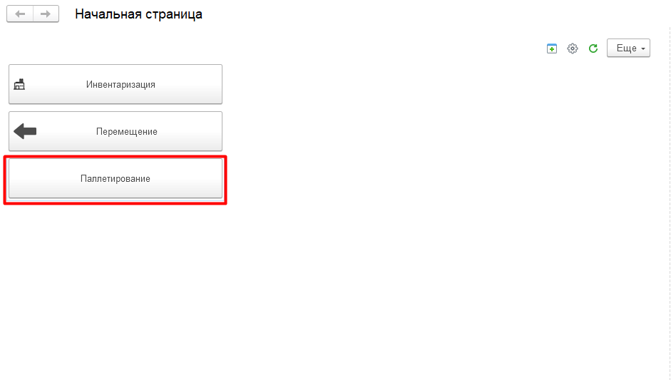
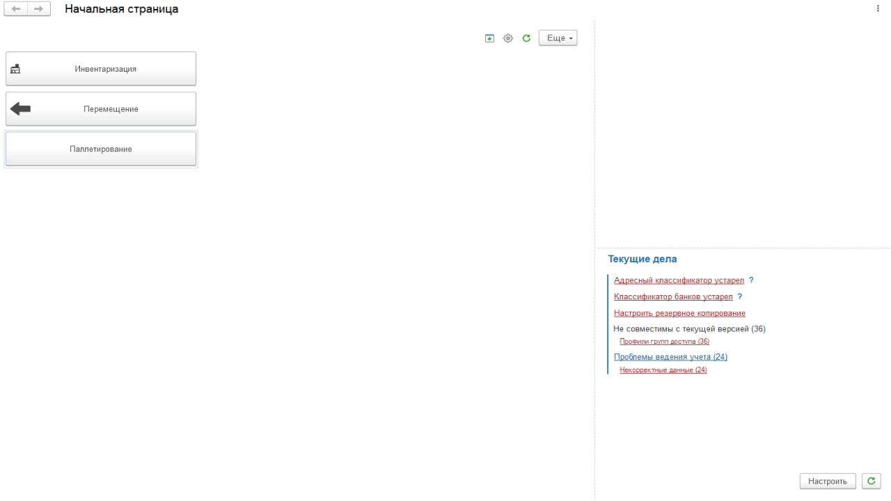

# Паллетирование коробов

Сыр был уложен в короба и промаркирован через специальное оборудование, а в системе нужно учесть эту упаковку. Для такой операции удобнее всего использовать ТСД (Терминал сбора данных), с помощью которого и будут сканироваться этикетки коробов.

Для ТСД настраивается стартовая страница с кнопками для сенсорного управления. Нажать кнопку для учета паллетирования:  

-   Указать дату и смену, если они еще не указаны;
-   Указать учетную точку, отвечающую за участок, где идет паллетирование;
-   Нажать кнопку, соответствующую набору паллеты;
-   Откроется форма наборки. Если паллета уже была начата, просканировать штрихкод паллеты, тогда подтянется весь её состав, а последующие отсканированные короба будут приписаны к ней;
-   Если наборка паллеты еще не начата, то просто начать сканирование. По итогам будет создан новый документ;
-   По порядку отсканировать все короба, которые помещаются на паллету. По кнопке **"Состав"** можно посмотреть текущий состав паллеты:   

-   После завершения набора паллеты нажать кнопку **"Завершить"**.

По итогу работы формируется документ **"Переработка"** и новый упаковочный лист (если велась наборка новой паллеты).

Если в системе ведется [Детальный учет по упаковочным листам](../../../../../Warehouse/LocationOfContainers/LocationPackageLists.md), то дополнительно будет сформирован документ **"Комплектация упаковочного листа"** с типом "Собрать", котрый запишет отсканированные короба на созданную паллету. Если велась наборка на уже начатую паллету, то будет сформирован документ **"Комплектация упаковочного листа"** с типом "Пересобрать", который актуализирует состав паллеты.