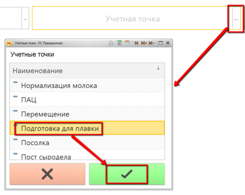
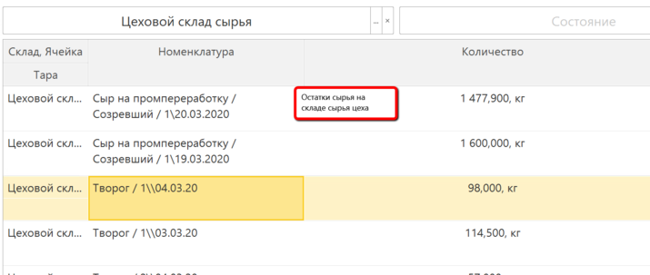
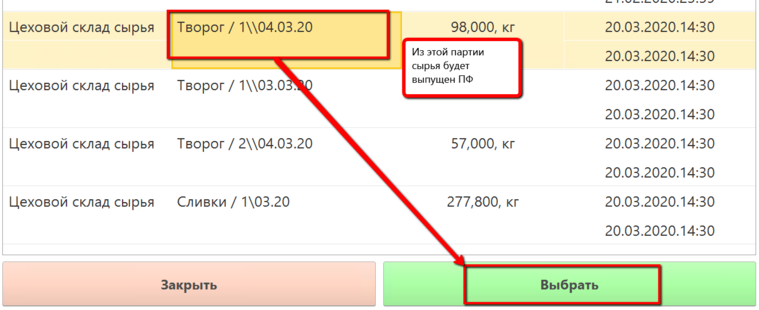
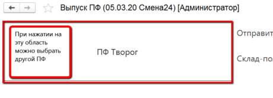
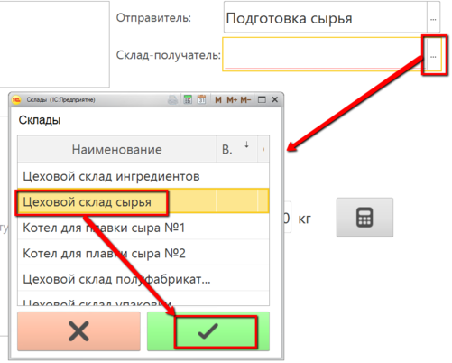
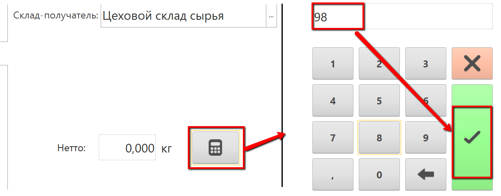

# Подготовка сырья

Каждая партия подготовленного сырья, передаваемая в производство,
взвешивается на одной из учетных точек. При взвешивании указывается
исходная партия сырья, из которой было получено подготовленное сырье.
Для этого используется обработка "Меню учетных точек".

 

 

-   Открыть "Меню учетных точек":  
    
     
-   Указать дату и смену, если они еще не указаны:  
    
     
-   Указать учетную точку, отвечающую за участок, где перевзвешивается
    сырье для плавленного сыра:  
    
     
-   Нажать кнопку, соответствующую учету полуфабрикатов. Откроется
    таблица с остатками сырья на складе сырья:  
    
     
-   Выбрать нужное сырье и его партию и нажать "Выбрать":  
    
     
-   Выбрать выпускаемый ПФ, если он подобрался другой:  
    
     
-   Указать, куда выпускается ПФ:  
    
     
-   Указать, сколько ПФ выпускается текущей передачей и подтвердить:  
    

