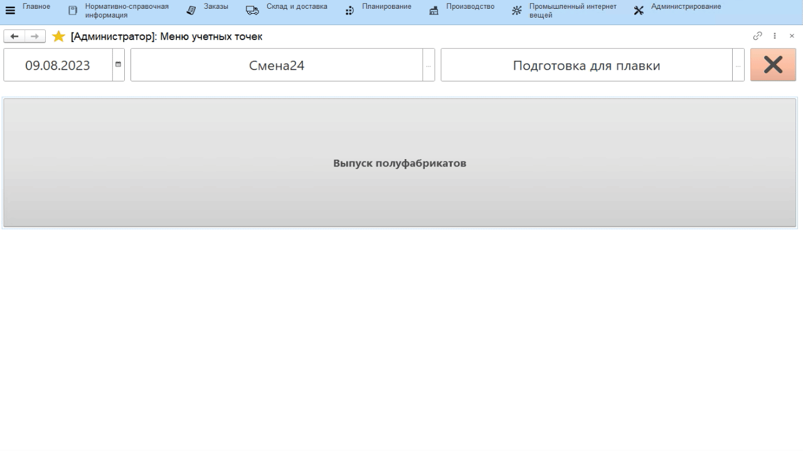

# Подготовка сырья

Каждая партия подготовленного сырья, передаваемая в производство,
взвешивается на одной из учетных точек. При взвешивании указывается
исходная партия сырья, из которой было получено подготовленное сырье.
Для этого используется обработка **"Меню учетных точек"**.

-   Открыть **"Меню учетных точек"**;
-   Указать дату и смену, если они еще не указаны;
-   Указать учетную точку, отвечающую за участок, где подготавливается сырье для плавленного сыра;
-   Нажать кнопку, соответствующую учету полуфабрикатов. Откроется таблица с остатками сырья на складе сырья;
-   Выбрать нужное сырье и его партию и нажать **"Выбрать"**;
-   Указать, куда выпускается ПФ (если не указано в настройках кнопки учетной точки);
-   Указать, сколько ПФ выпускается текущей передачей и подтвердить:  

