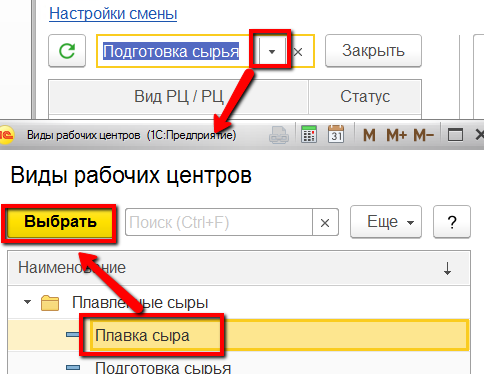
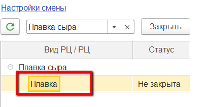
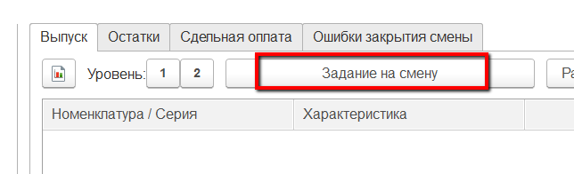
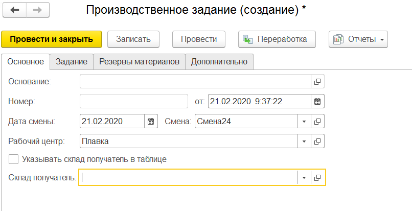
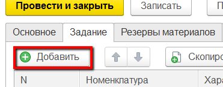
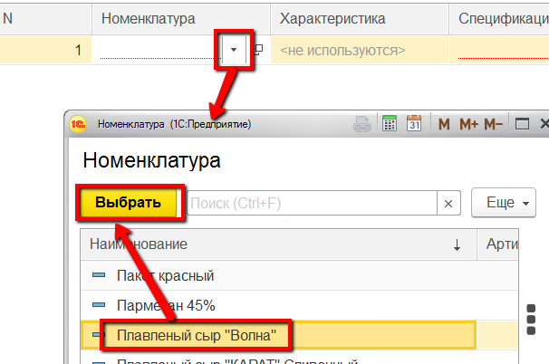
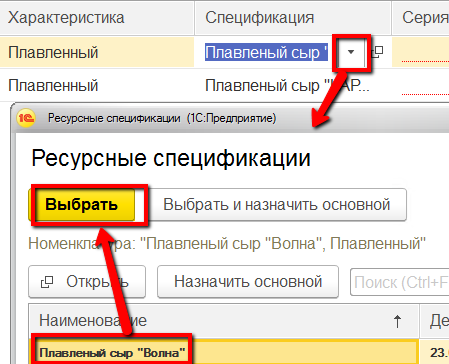
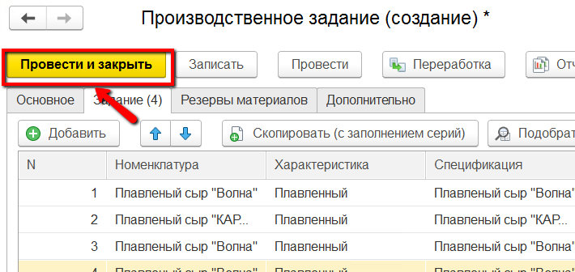
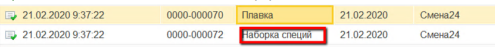
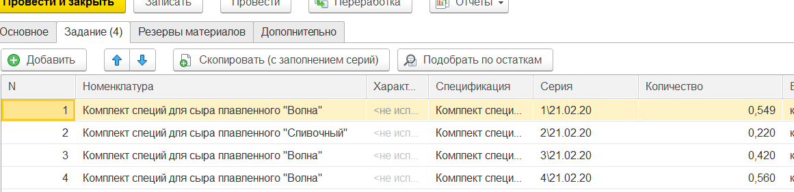

# Формирование задание на смену

На плавку сыров на каждую смену создается задание: сколько какого сыра
нужно переплавить. Мастер смены может сформировать его из своего
рабочего места.

 

 

-   Открыть "Рабочее место мастера смены":  
    
     
-   Указать дату и смену для задания:  
    
     
-   Указать участок, на котором плавится сыр:  
    
     
-   В таблице ниже выбрать участок, на который нужно выдать задание на
    плавку сыра:  
    
     
-   На вкладке "Выпуск" нажать кнопку "Задание на смену":  
    
     
-   Если задание на текущую смену уже было создано, тогда оно и
    откроется. Если нет, то откроется окно создания нового задания (при
    этом, там будет заполнена уже информация по смене и участку для
    задания):  
    
     
-   Перейти на вкладку "Задание" и нажать "Добавить":  
    
     
-   Указать сыр, который будет первым выпущен за смену (т.е. он будет иметь первую позицию в производственном порядке):  
    
     
-   При необходимости изменить рецептуру (если вместо основной будет
    использоваться другая):  
    
     
-   Затем также указать по очереди все следующие плавки сыров (заменяя рецептуры, где нужно) и нажать "Провести и закрыть":  
    

На основании задания на плавку будет задано также задание на наборку
    комплекта специй для каждой плавки:  
      
    

