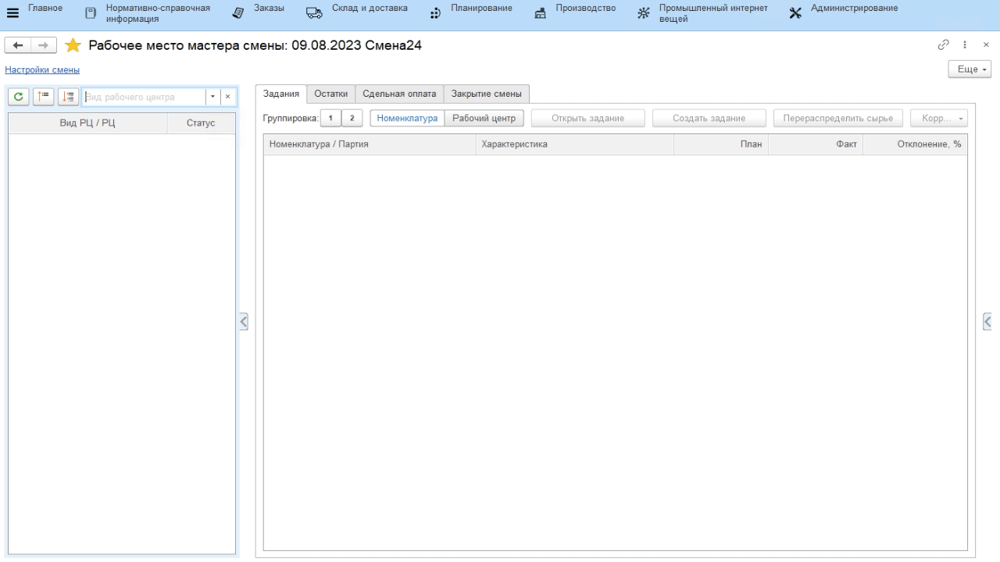
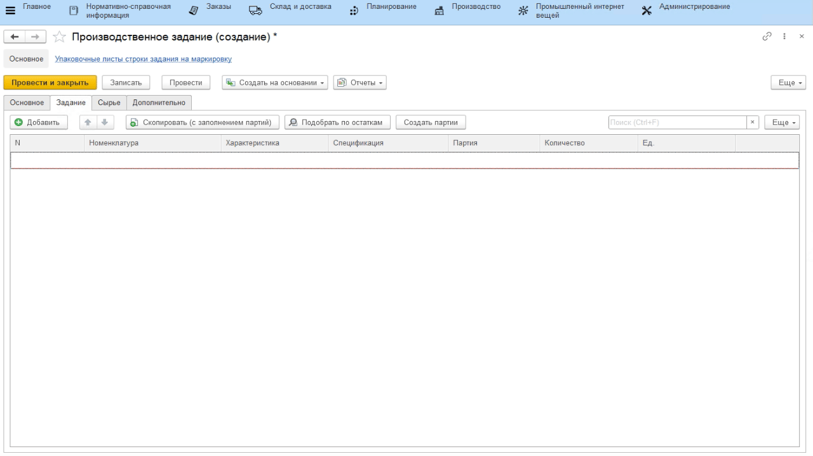
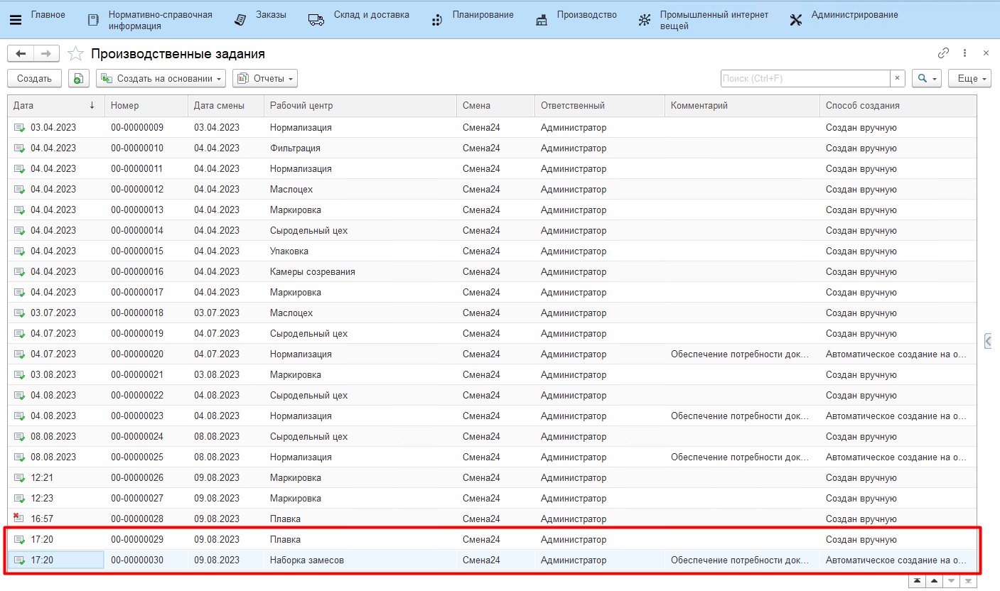
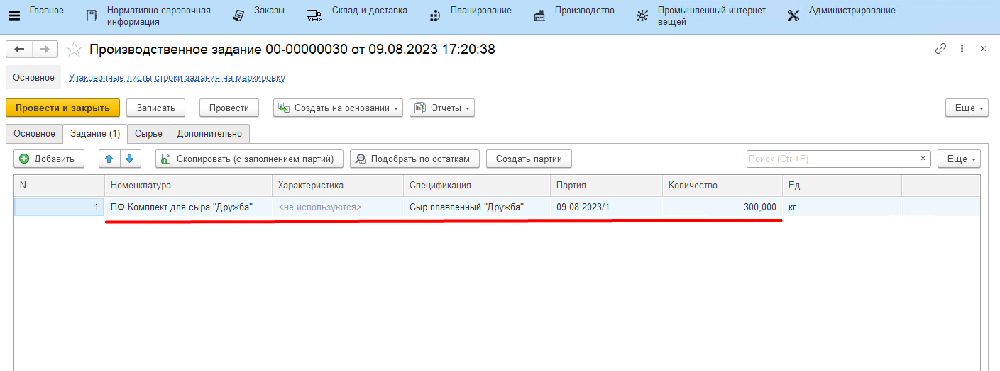
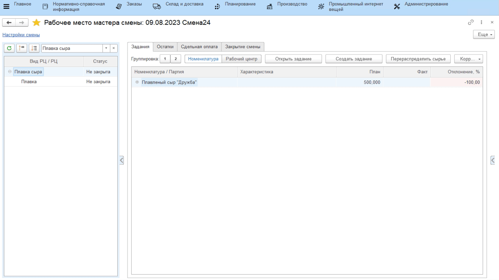

# Формирование задания на смену

На плавку сыров на каждую смену создается задание: сколько какого сыра
нужно переплавить. Мастер смены может сформировать его из своего
рабочего места.

-   Открыть **"Рабочее место мастера смены"**;
-   Указать дату и смену, на которую выдается задание;
-   Указать участок, на котором плавится сыр;
-   В таблице ниже выбрать участок, на который нужно выдать задание на
    плавку;
-   На вкладке *"Задание"* нажать кнопку **"Создать задание"**.

Если задание на текущую смену уже было создано, тогда оно и откроется. Если нет, то откроется окно создания нового задания (при этом, там будет заполнена уже информация по смене и участку для задания):  

-   Перейти на вкладку *"Задание"* и нажать **"Добавить"**;
-   Указать сыр, который будет первым выпущен за смену (т.е. он будет иметь первую позицию в производственном порядке);
-   При необходимости изменить рецептуру (если вместо основной будет
    использоваться другая);
-   Затем также указать по очереди все следующие плавки сыров (заменяя рецептуры, где нужно) и нажать **"Провести и закрыть"**:

На основании задания на плавку будет задано также задание на наборку комплекта сырья для каждой плавки: 

  

Тем же образом необходимо сформировать задание на набор комплекта специй. Для этого:

-   Открыть **"Рабочее место мастера смены"**;
-   Указать дату и смену, на которую выдается задание;
-   Указать участок, на котором подготовливаются комплекты;
-   В таблице ниже выбрать участок, на котором набираются специи;
-   На вкладке *"Задание"* нажать кнопку **"Создать задание"**;
-   Перейти на вкладку *"Задание"* и нажать **"Добавить"**;
-   Указать комплекты, которые должны быть набраны под плановые варки сыров;
-   Нажать **"Провести и закрыть"**:

