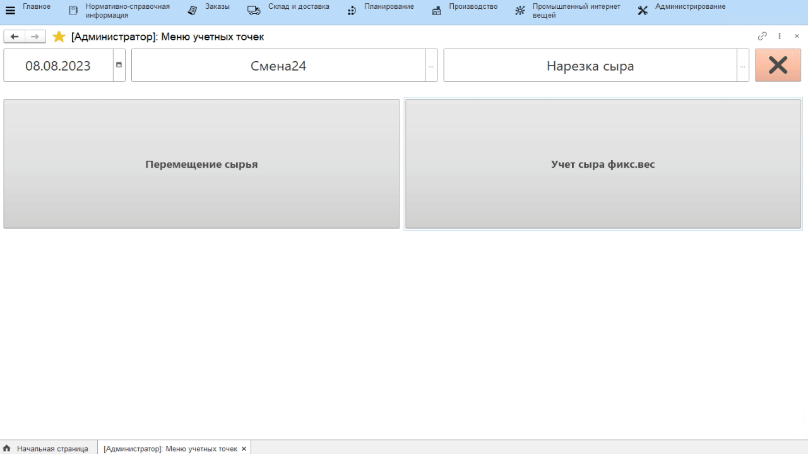

# Учет сыра фиксированного веса

Учет выпуска нарезанного сыра фикс.веса в системе происходит через
учетную точку, привязанную к участку нарезки.

-   Открыть **"Меню учетных точек"**;
-   Указать текущую дату и смену, если они еще не указаны;
-   Указать учетную точку, которая соответствует участку нарезки сыра;
-   Нажать кнопку, соответствующую выпуску нарезанного сыра фикс.веса.
    Отобразятся все варки сырья в кг и штуках, которые по учету в
    системе находятся на складе нарезки.
-   Нажать на нарезаемую варку сыра и нажать **"Выбрать"**;
-   В открывшейся форме указать, в каких коробах выпускается сыр;
-   Указать количество выпускаемых коробов. Автоматически пересчитывается вес;
-   Подтвердить, нажав кнопку с галочкой. Печатается этикетка на паллету
    с указанием ее состава:

