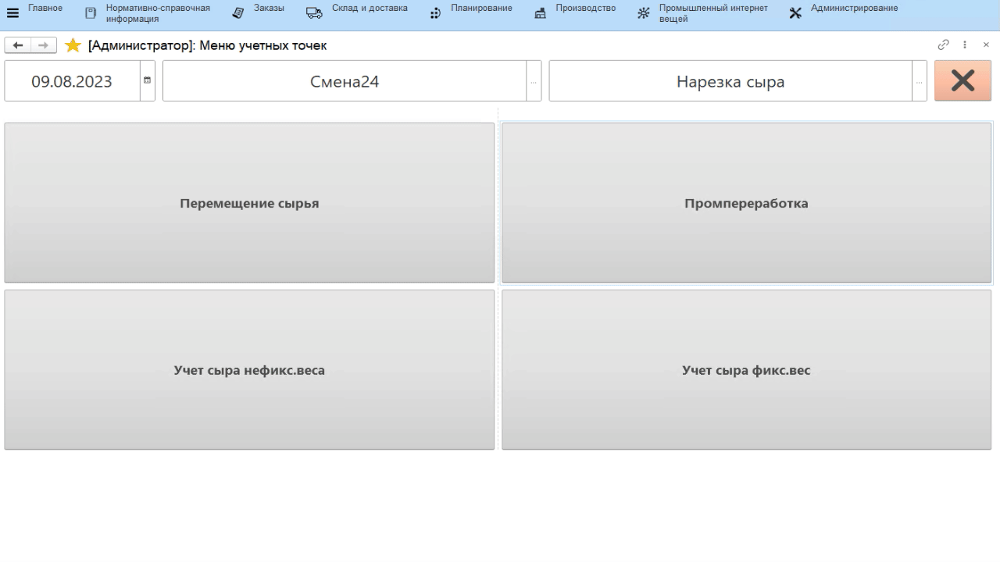

# Учет сыра на пром.переработку

Учет выпуска сыра на пром.переработку в системе происходит через учетную
точку, привязанную к участку нарезки.

-   Открыть **"Меню учетных точек"**;
-   Указать дату и смену, если они еще не указаны;
-   Указать учетную точку, отвечающую за участок, где идет нарезка;
-   Нажать кнопку, соответствующую выпуску сыра на пром.переработку.
    Откроются остатки на складе нарезки. Выбрать варку, с которой идет
    выпуск сыра и нажать **"Выбрать"**;
-   Указать, куда передается сыр (если еще не настроено в кнопке учетной точки);
-   Положить сыр на весы и нажать кнопку получения веса в систему или ввести вес вручную;
-   Подтвердить, нажав зеленую кнопку с галочкой:

