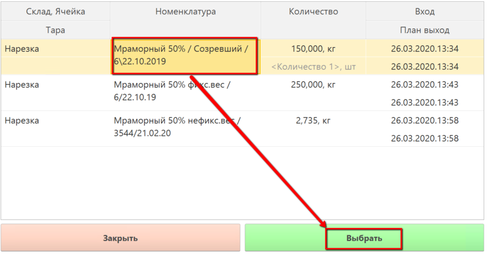
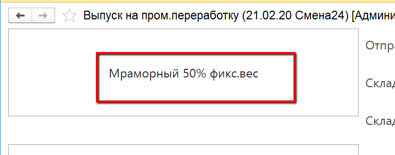
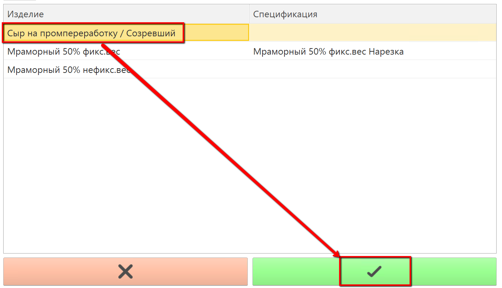
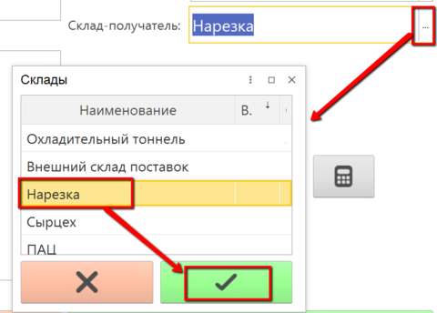
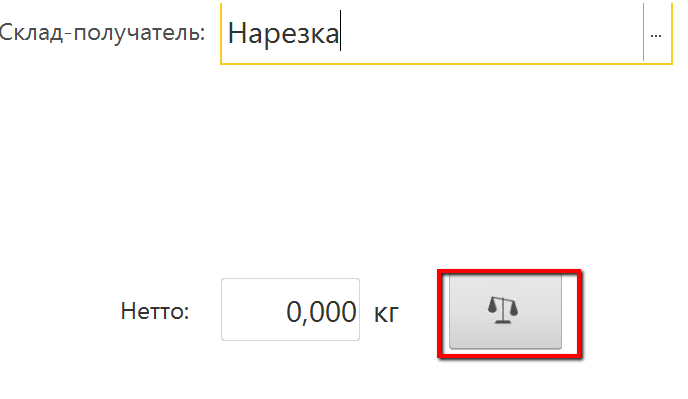

# Учет сыра на пром.переработку

Учет выпуска сыра на пром.переработку в системе происходит через учетную
точку, привязанную к участку нарезки.

 

 

-   Открыть "Меню учетных точек":
    
     
-   Указать дату и смену, если они еще не указаны:
    
     
-   Указать учетную точку, отвечающую за участок, где идет нарезка:
    
     
-   Нажать кнопку, соответствующую выпуску сыра на пром.переработку.
    Откроются остатки на складе нарезки. Выбрать варку, с которой идет
    выпуск сыра и нажать "Выбрать":
    
     
-   Указать, что выпускается сыр на пром.переработку:
    
    
     
-   Указать, куда передается сыр:
    
     
-   Положить сыр на весы и нажать кнопку получения веса в систему:
    
     
-   Подтвердить, нажав зеленую кнопку с галочкой.

