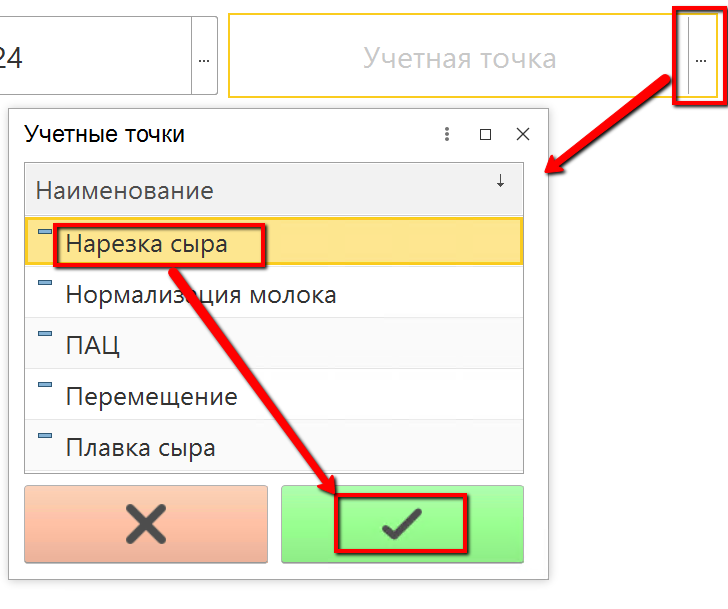
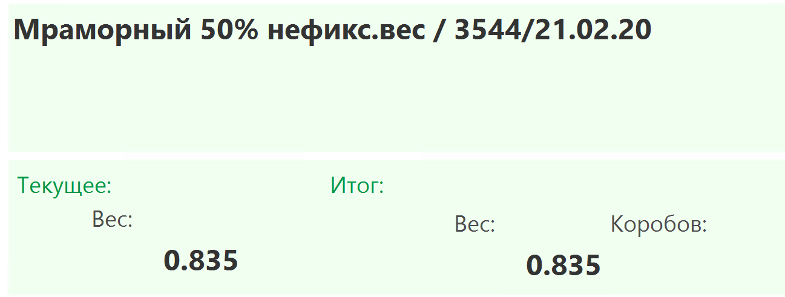
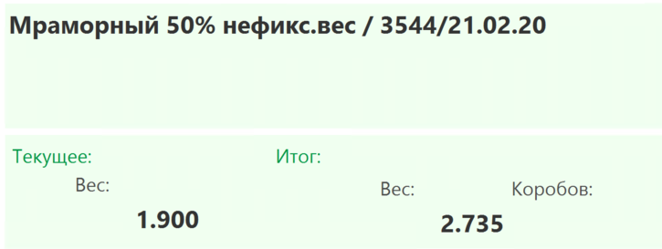
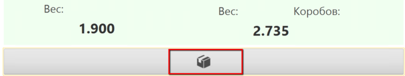
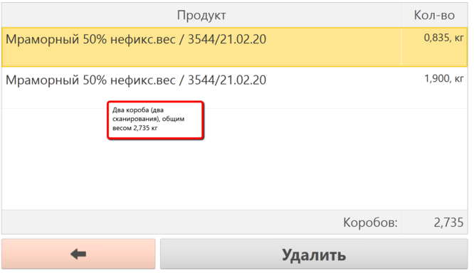

# Учет сыра нефикс.веса

Учет выпуска сыра нефикс. веса идет в два этапа: короба с таким сыром
маркируются через специальное оборудование, после чего в системе
учитывается факт маркировки и сам выпуск с использованием ТСД (учет
процедуры паллетирования таких коробов в системе дает и учет выпуска, и
учет маркировки).

 

 

-   Открыть "Меню учетных точек":
    
     
-   Указать дату и смену, если они еще не указаны:
    
     
-   Указать учетную точку, отвечающую за участок, где идет нарезка:
    
     
-   Нажать кнопку, соответствующую набору паллеты. Откроется форма
    наборки.

-   Начать сканирование. После сканирования первого короба в окне
    заполнится информация об его содержимом:
    
     
-   Отсканировать следующий короб паллеты и далее:
    
     
-   По кнопке с коробочкой можно посмотреть уже отсканированные короба:
    
    
     
-   После завершения набора паллеты нажать кнопку сохранения - зеленую
    кнопку с галочкой.
     