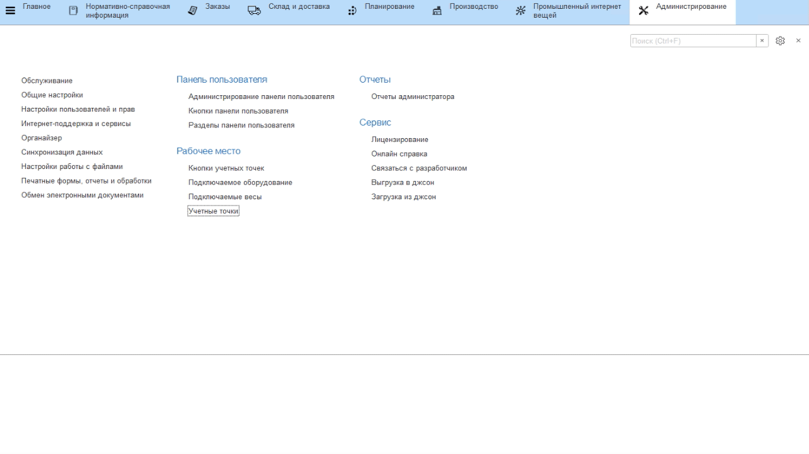
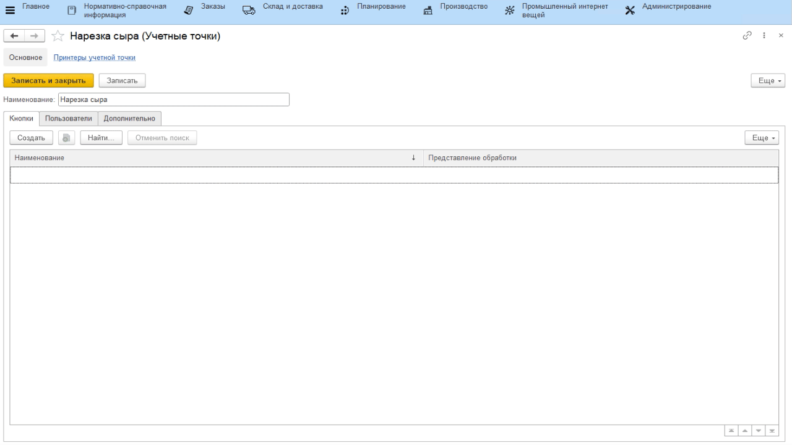
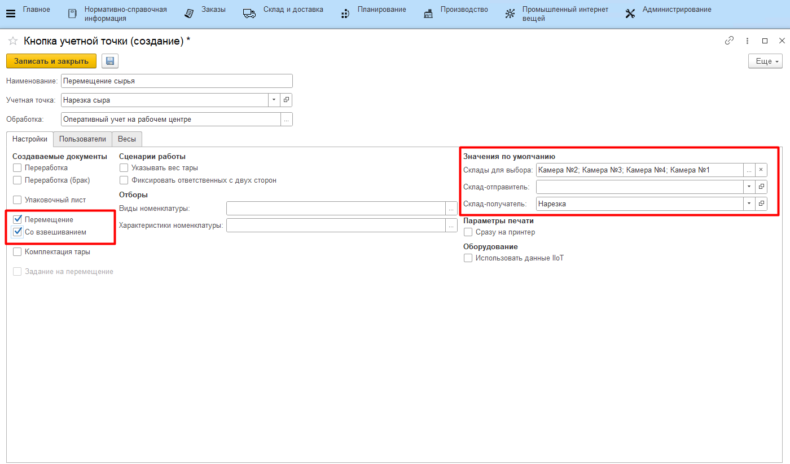

# Учетные точки

Настройка всех интерфейсов, через которые ведется оперативный учет на
участке нарезки сыра, происходит через справочники **"Учетные точки"** и
**"Кнопки учетных точек"**.

## Справочник "Учетные точки"

Данный справочник используется для того,
чтобы отделить наборы операций, выполняемых на разных участках
производства. Например, логично отделить операции, связанные с выпусками
на этапе нарезки сыра, от операций, связанных с выпусками на этапе
нормализации. При этом, если на предприятии на один только участок
нарезки ставится несколько сенсорных киосков (в ключевых точках -
отдельно около счетчика фикс.веса, отдельно около весов, где завешивают
нефикс.вес и тп), то разумно на каждый киоск сделать отдельную учетную
точку, пусть и  с одной операцией.

-   Открыть справочник **"Учетные точки"** и перейти к созданию нового
    элемента;
-   Указать наименование;
-   Указать список пользователей, у которых будет доступ к этой учетной
    точке (т.е. только они смогут выполнять операции, относящиеся к этой
    учетной точке);
-   Нажать **"Записать и закрыть"**.

## Справочник "Кнопки учетных точек"

Данный справочник используется для того, чтобы настраивать различные операции,
выполняемые на определенном участке производства. Например, для
этапа нарезки логично выделить кнопку для учета перемещения сырья, учета выпуска сыра фикс.веса, нефикс.веса и сыра на пром.переработку, а также кнопку маркировки сыра нефикс.веса.

-   Открыть справочник **"Учетные точки"**. Среди списка найти нужную,
    открыть;
-   В таблице кнопок нажать **"Создать"**;
-   Указать наименование и выбрать обработку **"Оперативный учет на рабочем центре"**;

-   Указать в создаваемых документах **"Перемещение"**;
-   Ограничить склады для выбора, откуда сырье может привозиться на
    нарезку и куда может выпускаться;
-   Указать склад нарезки (если он один);
-   Нажать **"Записать и закрыть"**.

 
Более подробная информация о параметрах кнопок учетных точек описана в
разделе ["Кнопки учетных точек"](../../../../CommonInformation/Handbooks/ButtonOfAccountPoint/readme.md).