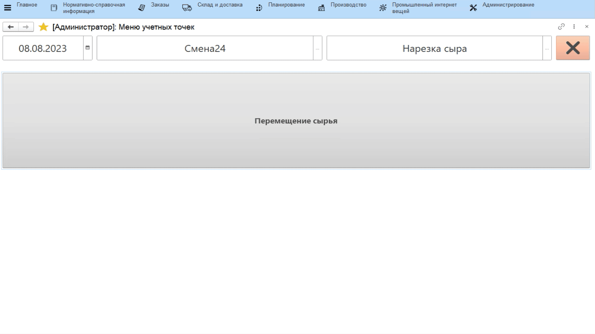

# Перемещение сырья для нарезки

Учет перемещения созревшего сыра на нарезку в системе происходит через
учетную точку, привязанную к участку нарезки. Если сырье "доставляется"
на контейнерах или других видах тар, то это могут учесть также водители
электрокаров с использованием ТСД (см.раздел "[Перемещение
сыра](../../Maturation/AutomationElectricCarDrivers/AccountingTransferCheese/AccountingTransferCheese.md)").

-   Открыть **"Меню учетных точек"**;
-   Указать текущую дату и смену, если они еще не указаны;
-   Указать учетную точку, которая соответствует участку нарезки сыра;
-   Нажать кнопку, соответствующую перемещению сыра. Указать склад, с
    которого сыр перемещается на нарезку;
-   Отобразятся все варки сыра в кг и штуках, которые по учету в системе
    находятся на выбранном складе.
-   Нажать на перемещаемую варку сыра и нажать **"Выбрать"**;
-   В открывшейся форме указать, на какой склад передается варка сыра
    (если не указано);
-   При необходимости перевзвесить сыр. Если к киоску подключены весы, то поставить сыр на весы и нажать
    кнопку получения веса в систему, в противном случае ввести вес
    вручную;
-   Указать количество перемещаемых штук сыра;
-   Подтвердить, нажав кнопку с галочкой.

