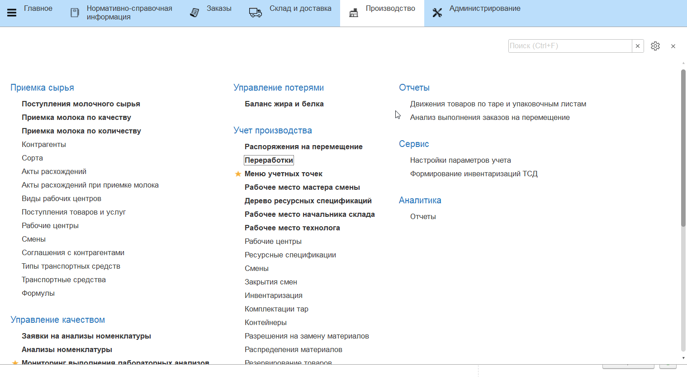
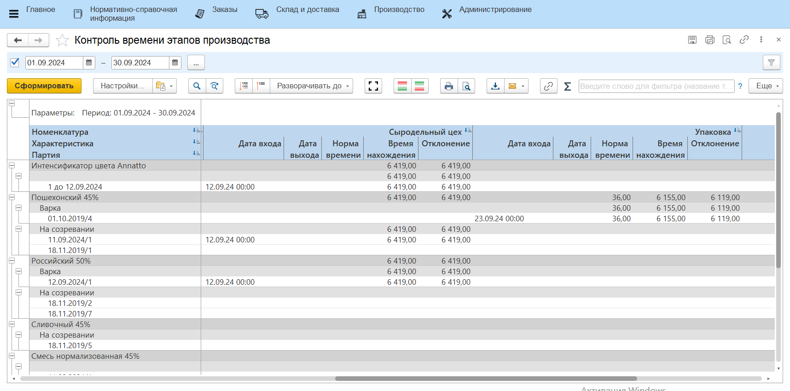

# Анализ эффективности технологии производства

По итогу учета в системе полной технологической цепочки той или иной
продукции, можно смотреть полноценные отчеты, отображающие всю историю
изготовления.

Из любого места, где отображается партия варки, можно "провалиться" в
информацию по технологическому процессу этой партии.

-   Из удобного места открыть партию продукции;
-   Нажать **"Паспорт партии"**:  

-   На форме отобразятся все этапы продукции, а также различная
    информация о течении этих этапов:  

- На форме можно будет видеть:
    -   Расход на кг и выпуск сырья на разных этапах;
    -   Нормативный расход на кг и выпуск сырья на разных этапах;
    -   Количество материалов, потраченных на весь выпуск на каждом этапе, в сравнении с нормой и их время внесения;
    -   Качественные показатели продукции;
    -   Параметры тех.процесса продукции;
    -   Время нахождения продукции на складах производства;
    -   Показатели складов, на которых продукция "была" на каждом из этапов производства;
    -   Ответственных за ключевой этап производства - варку.

Есть также сборный отчет **"Анализ варки сквозной"**, который по факту,
очень похож на выше описанную обработку, но отображается немного в другом виде и может быть настроен.

-   Открыть отчет **"Анализ варки сквозной"**:  

  

 
-   Указать период, за который нужно проанализировать выпущенные варки;
-   Указать участок, на котором происходит выпуск варок сыра:  
    
!!! info ""
    Период влияет именно на выпуск (первое "появление" на указанном РЦ), информация по анализам, материалам и прочему подтягивается независимо от периода.  

    
- Можно ограничить список отображаемых в отчете:
    -   материалов;
    -   качественных показателей;
    -   параметров тех.процесса;
    -   показателей помещений;
    -   этапов для анализа (где и сколько на конкретном этапе "провела"времени продукция);        

!!! info "" 
    Показатели **"Дата поступления"** и **"Время нахождения"** - специальные показатели, если есть необходимость их видеть в отчете, то в отборе нужно задать их строкой:  

  

-   Сохранить настройки и сформировать.

- Тогда в отчете в разрезе каждой варки, выпущенной в указанный период, будет отображена информация по:
    -   Выпущенному объему в кг;
    -   Сколько было потрачено смеси на этот выпуск;
    -   Сравнение нормативного выхода сыра из смеси с фактическим (столбцы
        "% выхода");
    -   Количество потраченных материалов (материалы либо все, либо только
        выбранные в настройках);
    -   Качественные показатели варки (либо все, либо выбранные в
        настройках);
    -   Показатели тех.процесса варки (либо все, либо выбранные в
        настройках);
    -   Показатели складов, на которых находилась варка за указанные этапы (либо за все), время поступления на эти склады и время нахождения там;
    -   Ключевые лица в процессе варки: Сыродел, Солильщик и Мастер смены.

Для контроля и анализа временных показателей производственного процесса на каждом рабочем центре предназанчен отчет **"Контроль времени этапов производства"**. Отчет расположен в разделе **"Производство"** в подсистеме **"Аналитика"** - **"Отчеты"**.

Для формирования отчета необходимо:

- указать дату начала периода аналитики;
- указать дату окончания периода.
- нажать **"Сформировать"**.

Установка периода аналитики не является обязательным. Можно не задавать даты для отображения всех данных без ограничений.

Для каждого из рабочих центров, задействованных в производственном процессе, отчет содержит следующую информацию:

- **Количество выпуск** - количество выпуска выбранной партии;
- **Дата входа** - дата поступления партии на данный рабочий центр;
- **Дата выхода** -  дата выхода партии с данного рабочего центра. При отсутствии выпуска данная колонка будет не заполненной;
- **Норма времени** -  время, необходимое для обработки партии продукции на данном рабочем центре. Задается в ресурсной спецификации;
- **Время нахождения** -  время нахождения партии на рабочем центре;
- **Отклонение** - отклонение фактического времени нахождения на рабочем центре от нормативного.
