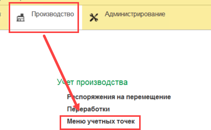
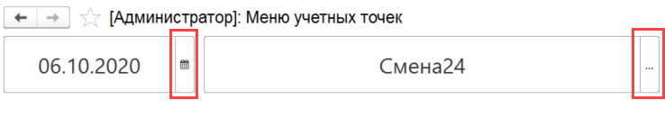
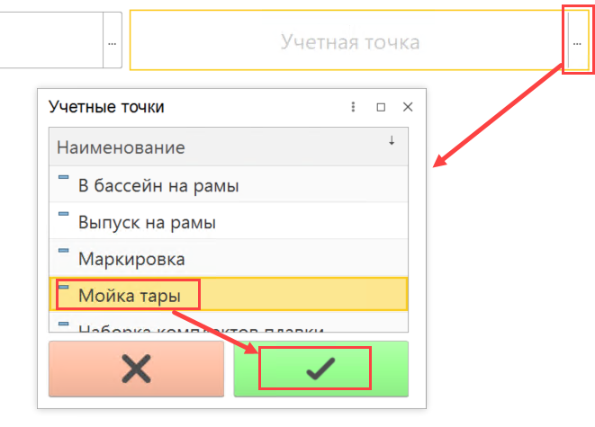
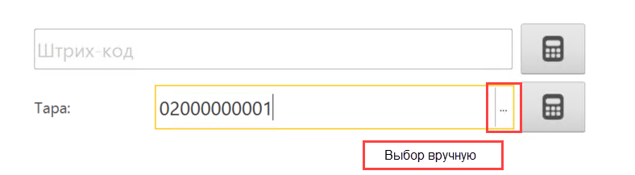
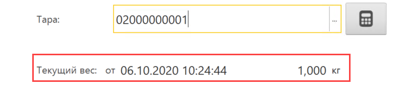
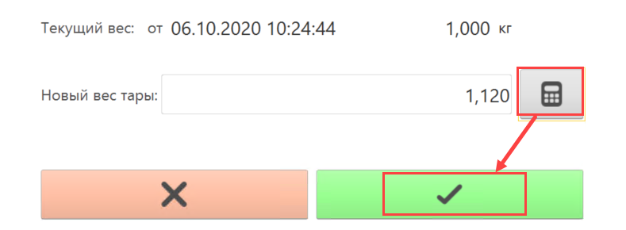

# Взвешивание тары

Со временем вес тары может меняться - убирается какая-то досочка или наоборот - добавляется. Потому важно такие моменты тоже периодически учитывать в системе.

- Открыть "Меню учетных точек":

  

- Указать текущие дату смены и смену:

  

- Выбрать учетную точку для перезавешивания тар:

  

- Нажать на соответствующую кнопку. Откроется окно перезавешивания тары.

- Просканировать штрихкод тары или выбрать его вручную:

  

- Если у тары уже были перезавешивания, будет видно, когда это было последний раз:

  

- Указать новый вес тары и подтвердить операцию:

  

- Повторить действия для остальных тар (если идет перезавешивание нескольких).