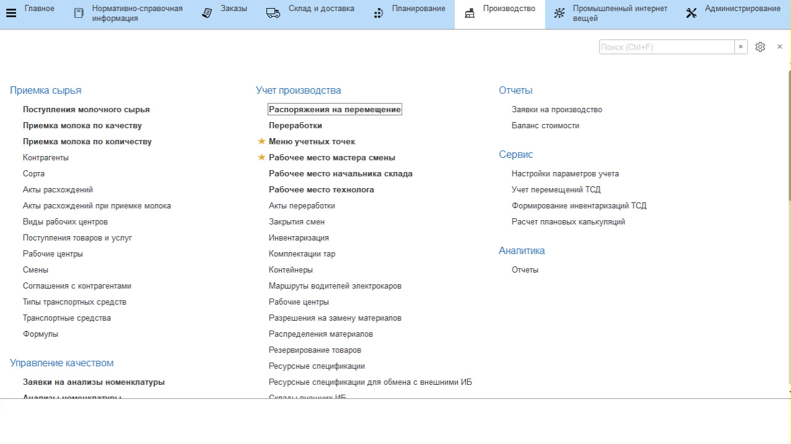
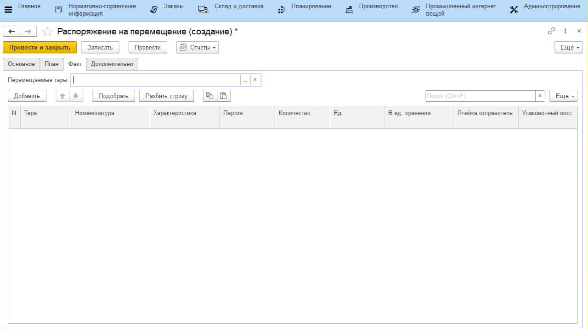

# Перемещение с другого склада

Поступления материалов с другого склада фиксируются документом
**"Распоряжение на перемещение"**.

-   Открыть документы **"Распоряжения на перемещение"** и перейти к созданию
    нового;
-   Указать, с какого склада поступили материалы;
-   Указать, на какой склад поступили материалы;
-   Отметить, что материалы уже поступили (статус документа - *"Выполнено"*);
-   Если учет поступлений идет неоперативно (поступление было предыдущим
    днем, неделей и т.п.), то указать фактическую дату поступления;

-   Перейти на вкладку *"Факт"* и нажать **"Добавить"**;
-   Указать, какой материал поступил;
-   Указать его партию или создать новую, если в списке отсутствует поступившая;
-   Указать количество поступившего материала;
-   Повторить для остальных материалов и нажать **"Провести и закрыть"**:

