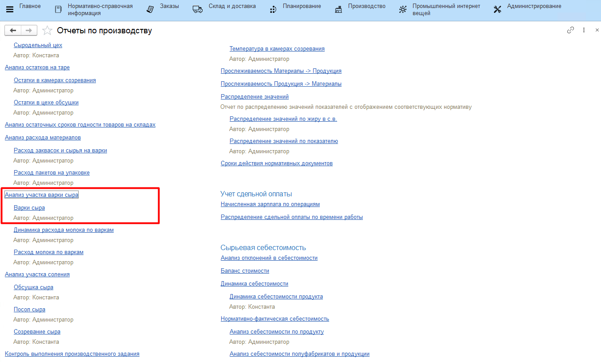
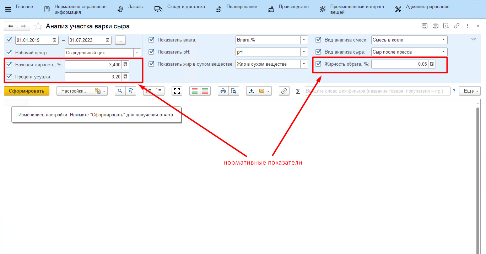
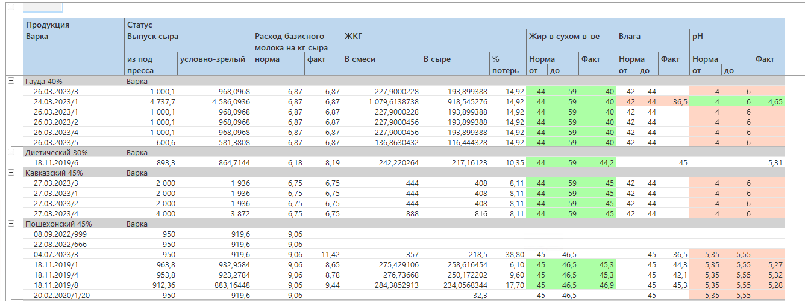

# Анализ эффективности по варкам

С помощью отчета по варкам сыра можно проанализировать эффективность
участка варки.

-   Открыть отчеты подсистемы **"Производство"**:

-   Из списка отчетов открыть **"Анализ участка варки сыра"**: 

-   Указать период и остальные параметры отчета и нажать **"Сформировать"**:

-   За указанный период отобразится следующая информация: 
 
    - колонка *"Из-под пресса"* - сколько сыра сварили;
    - колонка *"Условно-зрелый"* - сколько должно получиться созревшего сыра в килограммах;
    - колонка *"ЖКГ в сыре"*, *"ЖКГ в смеси"*, *"Процент потерь"* - жиробаланс продукции и материала, а также фактические потери по жиру;
    - фактические и нормативные показатели основных анализов качества сыра.

