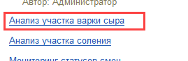
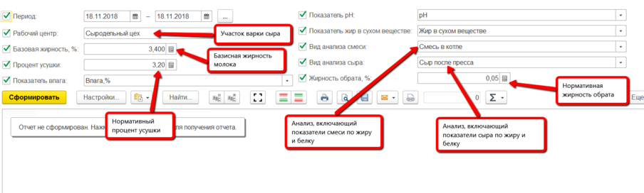
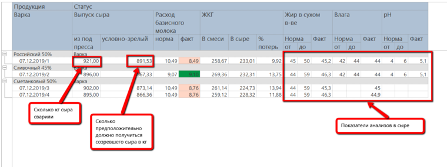

# Анализ эффективности по варкам

С помощью отчета по варкам сыра можно проанализировать эффективность
участка варки.

-   Открыть отчеты подсистемы "Производство":  
    
    
-   Из списка отчетов открыть "Анализ участка варки сыра":  
    
    
-   Указать период и остальные параметры отчета и сформировать:  
    
    
-   За указанный период отобразится следующая информация:  
    
