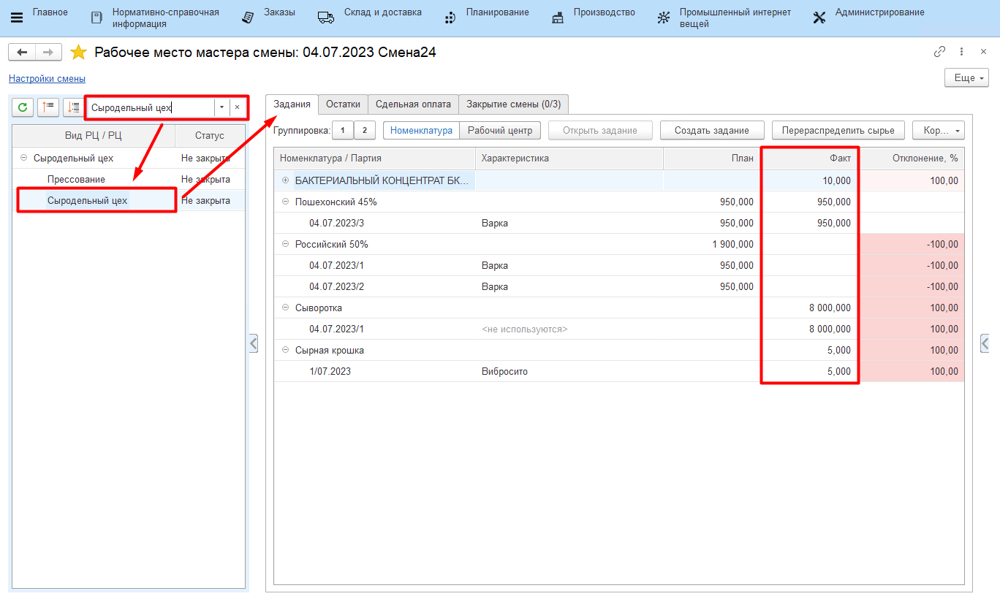
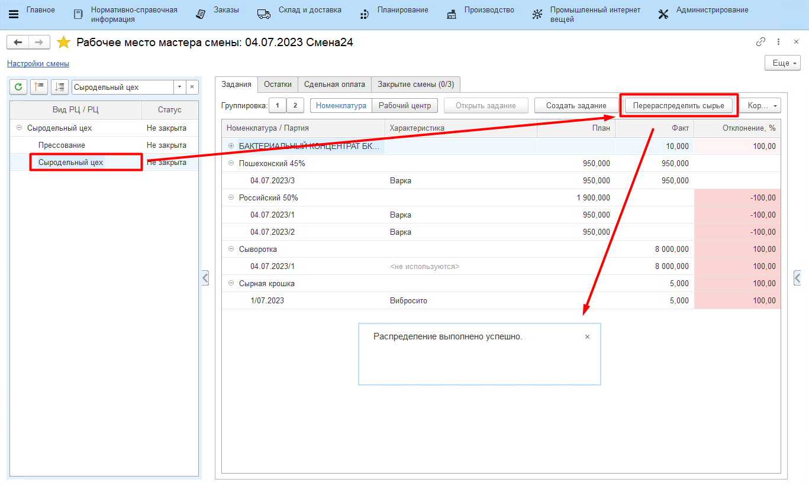
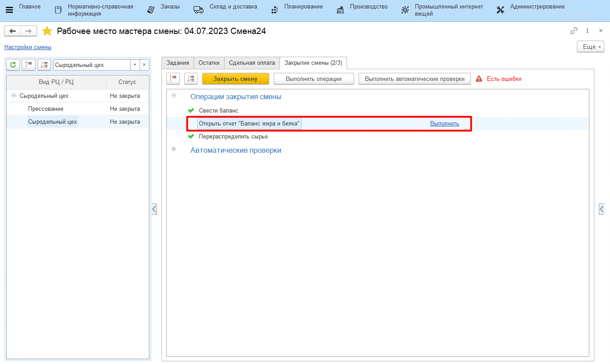
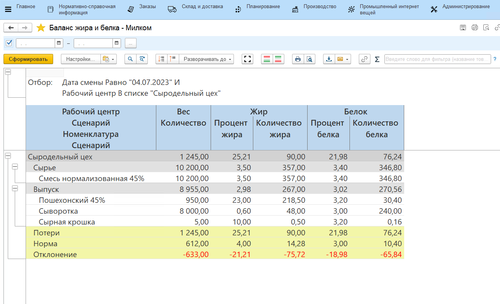
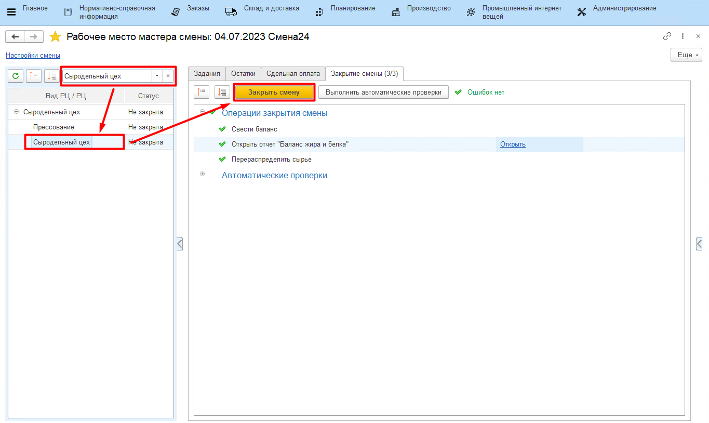

# Закрытие смены

Контроль всех введенных в систему данных за рабочую смену осуществляется
мастером смены через **"Рабочее место мастера смены"**.

-   Открыть **"Рабочее место мастера смены"**;
-   Указать смену для контроля и вид рабочего центра, к которому относится участок варки сыра;
-   В таблице выбрать участок сыродельного цеха, который необходимо
    проверить на корректность. Справа заполнится различная информация по
    данному участку. Например, на вкладке *"Задания"* отображается вся
    информация по выпускам за указанную смену:

 
    
-   Здесь же необходимо распределить смесь, потраченную на варки сыра,
    еще и на побочные выпуски (на сыворотку и сырную крошку). Для этого
    нажать кнопку **"Перераспределить сырье"**;

 

-   На вкладке *"Закрытие смены"* можно свести или посмотреть ранее сведенный
    баланс по жиру и белку. Для сведения баланса на участке нажать
    **"Свести баланс"**;

-   Затем нажать **"Открыть отчет "Баланс жира и белка""**;

-   Здесь можно видеть:
    -   Сколько какого продукта было выпущено, сколько при этом потратилось
    сырья;
    -   Какое было содержание жира и белка в сырье, какое получилось в
    выпусках (как в кг, так и в %);
    -   Получившийся процент потерь по кг, жкг и бкг и нормативный. 
    

-   После выполнения всех вышеперечисленных действий и проверки
    корректности всех данных, смену необходимо закрыть для невозможности
    внесения в нее изменений. Для этого выбрать участок в таблице слева
    и нажать **"Закрыть"**; 
-   При закрытии могут возникнуть ошибки (не сведен баланс, не
    распределено сырье или т.п.) . Исправить их, после чего вернуться и
    снова нажать  **"Закрыть"**.

