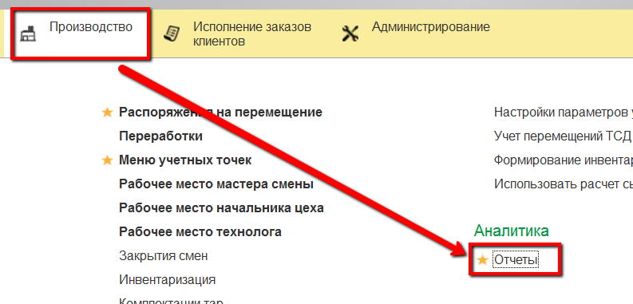
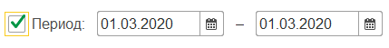
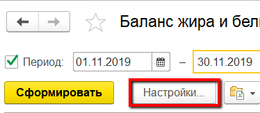
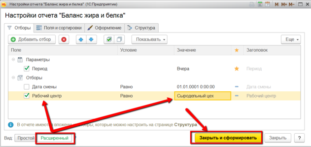
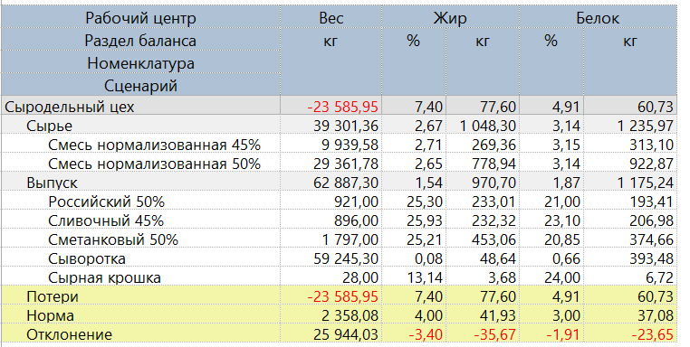
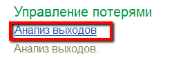
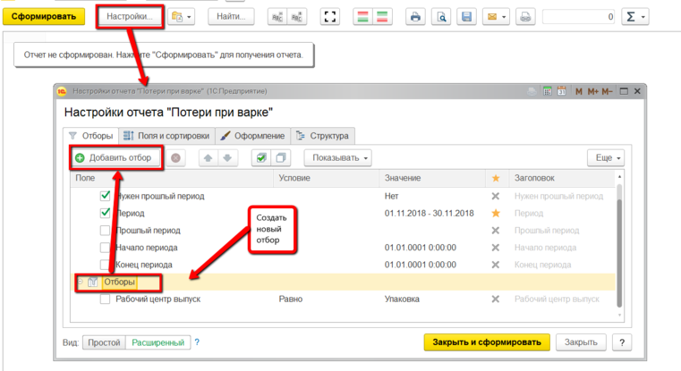
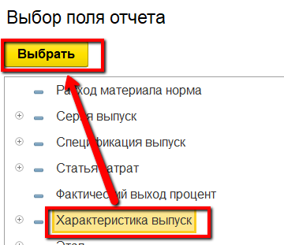
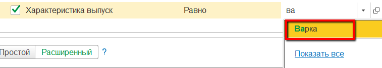
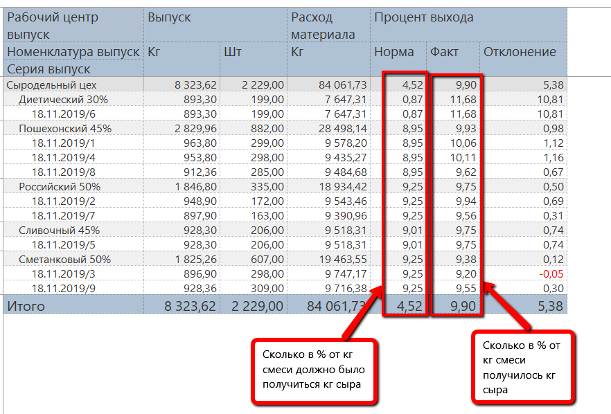

# Анализ потерь

Несколько отчетов позволяют отслеживать и анализировать получившиеся
потери на этапе варки сыра.

 

 

-   Открыть отчеты подсистемы "Производство":  
    
    
-   Из списка отчетов открыть "Баланс жира и белка" (подробнее об этом
    отчете в разделе "[Закрытие смены](../CloseWorkShift/CloseWorkShift.md)"):  
    
    
-   Указать период, добавить отбор по участку варки сыра и сформировать:  
      
        
      
    Тогда в таблице отобразятся потери по кг, жиру и белку:  
    

Еще один отчет "Анализ выходов" позволяет увидеть, какой должен был
    быть нормативный расход смеси в кг и какой в итоге получился:  
    
     
-   Указать период, характеристику выпуска "Варка" и сформировать:  
      
       
      
    В отчете будет видна информация по расходу по каждой варке сыра за
    указанный период:  
    

